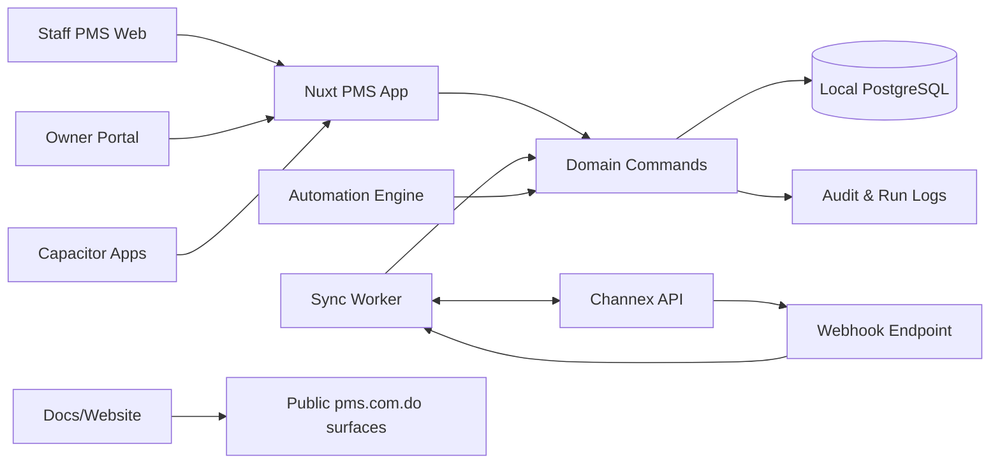
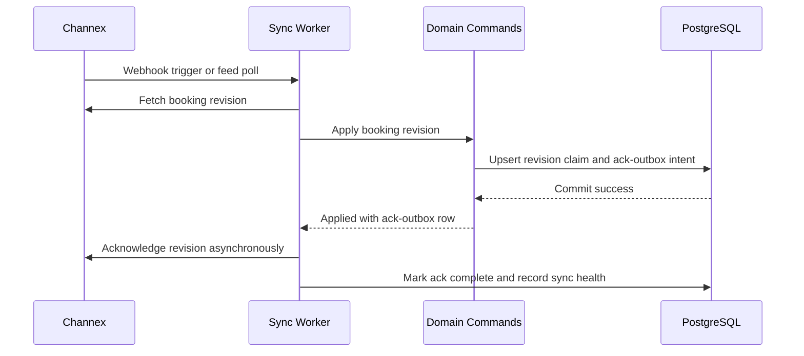
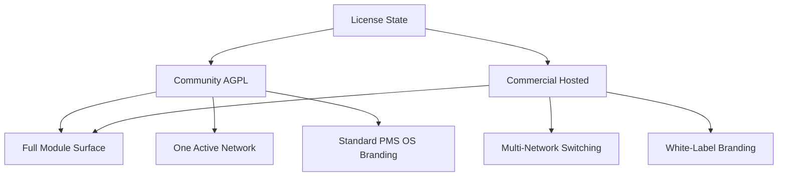
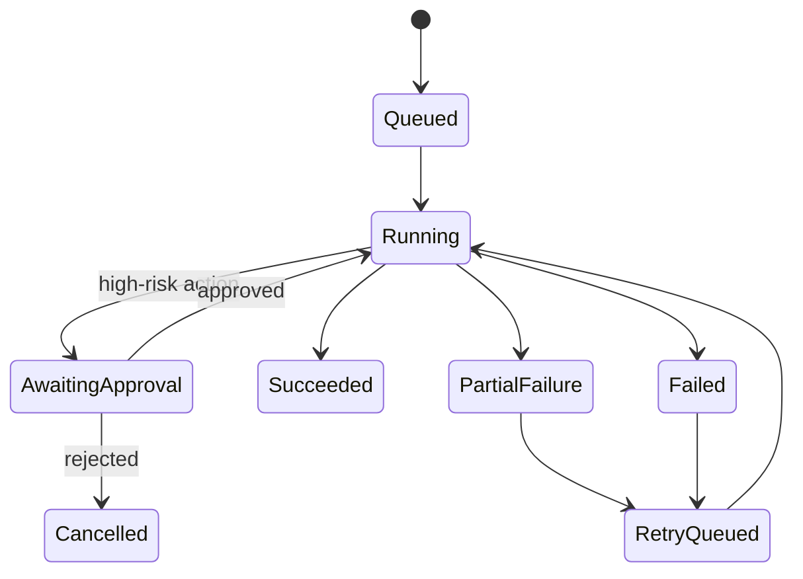

# feat: Build PMS OS platform

## Goal Capsule

Build **PMS OS**, a Channex-backed property-management platform for `https://pms.com.do`, as a Nuxt 4 + Turborepo + shadcn-vue monorepo with local PostgreSQL, Drizzle, better-auth, deterministic automation, Owner portal, Capacitor mobile apps, public docs/website, commercial feature gates, and Docker hosting artifacts.

Channex is the source of truth for hospitality inventory and booking connectivity; PMS OS owns the local tenant model, users, permissions, operational workflows, automation, owner views, reporting, docs, hosted/commercial packaging, and a synced query layer.

Stop and re-plan if implementation discovers that Channex cannot support idempotent booking ingestion/acknowledgement for the v1 sync model, if commercial feature gating cannot be cleanly isolated from AGPL community code, if OpenPanel hosting constraints require a materially different deployment topology, or if hosted deployment cannot provide backup/restore, migrate-before-traffic, and webhook-after-worker-health guarantees.

## Product Contract

### Summary

This plan targets one deep phased build of PMS OS: foundation, Channex sync, app shell/navigation, core PMS modules, Owner portal, Capacitor mobile apps, docs/website, commercial feature gates, and Docker hosting.

### Problem Frame

The product needs a professional PMS that can be self-hosted as a community edition and offered by the project owner as a commercial hosted platform.
The key architectural constraint is that the PMS relies on Channex for OTA/channel connectivity, so PMS OS must avoid becoming a competing source of truth for inventory or bookings while still providing a fast local operational experience.

The repo is greenfield at `pms-os`; the plan therefore establishes conventions, folder structure, boundaries, and verification policy instead of extending existing project patterns.
The implementation should follow the Ponytail guidance supplied by the user: reuse before inventing, no unnecessary dependencies, smallest working diff, boring code, input validation at trust boundaries, and one runnable check for non-trivial logic.

### Actors

| ID | Actor | Description |
|---|---|---|
| A1 | Community operator | Self-hosts PMS OS and uses one network/property portfolio without commercial multi-network or white-label features. |
| A2 | Hosted commercial operator | Uses the hosted `pms.com.do` platform with commercial features such as multi-network switching and white-label branding. |
| A3 | Staff user | Runs front-desk, reservations, tasks, guest messaging, and operational workflows inside a permitted network/property scope. |
| A4 | Property owner | Uses the Owner portal for read-only portfolio, booking, occupancy, and revenue visibility. |
| A5 | Platform administrator | Maintains hosted deployment, licensing, docs, sync health, and commercial configuration. |
| A6 | Channex | External source of truth for properties, room types, bookings, OTA connectivity, and later rates/availability write-back. |

### Requirements

| ID | Requirement |
|---|---|
| R1 | The repository uses a Turborepo + pnpm workspace structure with Nuxt 4 apps and shared packages for database, auth, UI, sync, domain commands, licensing, and deployment artifacts. |
| R2 | The main PMS app uses Nuxt 4 with the `app/` directory, TypeScript, shadcn-vue, Tailwind v4, lucide icons, and a responsive shell that works on desktop and mobile web. |
| R3 | The product is licensed as AGPLv3 community software with a separate commercial license path for the hosted offering. |
| R4 | Community edition exposes the full PMS module surface, while commercial gates only multi-network management and white-label branding. |
| R5 | All business data is scoped to an organization/network boundary, with community deployments limited to one active network and commercial hosted deployments able to switch among multiple networks. |
| R6 | Channex is the source of truth for properties, room types/rooms, and bookings in v1; local PostgreSQL stores synced copies, mappings, operational extensions, users, permissions, automation, and reports. |
| R7 | Channex v1 sync imports properties, room types/rooms, and booking revisions/reservations with idempotent upserts, dead-letter handling, and acknowledgement only after successful local persistence. |
| R8 | Channex webhooks trigger fast sync, but a pull-based booking revision feed remains the reliability fallback. |
| R9 | Rates and availability appear in v1 as read-only or partial cached surfaces; full ARI write-back is deferred until after booking/inventory sync is stable. |
| R10 | Manual/direct reservations must either push to Channex or remain visibly pending sync; they must never silently become local-only bookings that can create double-sell risk. |
| R11 | The sidebar uses the agreed PMS OS structure: Dashboard, Calendar, Reservations, Inbox, Tasks, Properties, Rates, Reports, Automation, Guests, Reviews, Payments, and expandable Settings. |
| R12 | Settings includes General, Team & Permissions, Integrations, Billing & Subscription, Notifications, Security, and API & Webhooks. |
| R13 | Each PMS module has the expected feature surface listed in this plan, with v1 depth bounded by the phase-specific decisions. |
| R14 | Authentication and authorization use better-auth, Drizzle/PostgreSQL, fixed roles, property scoping, and command-layer enforcement. |
| R15 | Automation v1 is a deterministic rules engine over shared domain commands, not an LLM assistant or MCP surface. |
| R16 | High-risk automation actions have approval, dry-run, audit, and retry behavior proportional to the external or irreversible effect. |
| R17 | The Owner portal provides property-owner login, scoped read-only views, occupancy/revenue/reservation visibility, and later statement surfaces. |
| R18 | Capacitor mobile apps wrap the PMS web shell with mobile navigation and push notifications first; offline-first behavior is deferred. |
| R19 | Docker hosting artifacts support app, worker, PostgreSQL, migration, and reverse-proxy deployment for the hosted `pms.com.do` OpenPanel context without hardcoding secrets, and define how hosted traffic and webhooks are enabled safely. |
| R20 | Public docs and marketing website live in the same monorepo but stay separated from the application and commercial-only code paths. |
| R21 | The system exposes sync health, Channex credential state, last import, webhook/pull status, failed revisions, warnings, and recovery actions in Settings > Integrations. |
| R22 | Non-trivial logic leaves a focused runnable check, especially sync mappers, idempotency, permission guards, money/date calculations, licensing gates, and domain commands. |
| R23 | All mutating and sensitive-read APIs enforce authentication, authorization, network scope, and property scope server-side in the command/query layer; UI checks are never sufficient. |
| R24 | Channex API keys and webhook secrets are encrypted at rest, masked in UI/API responses, rotatable, redacted from logs, and accessible only to authorized administrators. |
| R25 | Channex webhooks authenticate per network, reject stale/replayed deliveries, and bind queued sync work to the verified network rather than trusting submitted IDs. |
| R26 | Sync workers and automation run as explicit least-privilege system principals scoped to the relevant network/property context. |
| R27 | Commercial entitlements for multi-network and white-label fail closed and are enforced by server-side domain commands as well as UI affordances. |
| R28 | Owner portal APIs return a minimum necessary allowlist of owner-visible booking, occupancy, revenue, and property fields; staff-only notes, credentials, and unrelated guest PII stay hidden. |
| R29 | Production auth includes secure session cookie posture, CSRF protection for cookie-session mutations, session revocation, privileged-role 2FA, login history, and rate limiting for sensitive auth paths. |
| R30 | Channex sync uses an ack outbox: local revision application and ack intent commit together, and Channex acknowledgements are retried asynchronously without re-applying committed revisions. |
| R31 | Schema and domain logic preserve data integrity invariants: per-network Channex uniqueness, mapping-before-apply, Channex-owned vs PMS-owned field ownership, integer minor-unit money, property-local stay dates, append-only audit/payment ledger, and soft-archive for disconnected properties. |
| R32 | Docker hosting includes launch-readiness, post-deploy verification, monitoring, backup/restore, rollback classes, and stop/go criteria for first production cutover and later releases. |

### Key Flows

| ID | Flow |
|---|---|
| F1 | Operator creates the workspace, configures Channex credentials, imports properties and room types, backfills booking revisions, and reaches a live Dashboard. |
| F2 | Channex webhook or scheduled pull discovers a booking revision, PMS OS fetches and applies it idempotently, commits the local row changes, acknowledges the revision, and records sync health. |
| F3 | Staff use Calendar and Reservations to view bookings, inspect guest details, manage check-in/out status, create operational tasks, and see pending Channex sync state. |
| F4 | Staff create a direct reservation, PMS OS checks local availability context, attempts Channex write-back, and either marks synced or pending-sync with visible recovery. |
| F5 | Staff triage Inbox messages and reservation-linked guest context, using templates and audit-backed replies. |
| F6 | Staff or managers configure deterministic Automation rules that create tasks, notify staff, send approved guest templates, or queue safe domain commands. |
| F7 | Property owners log into the Owner portal and see only their scoped properties, bookings, occupancy, and gross revenue summaries. |
| F8 | Platform admin builds and deploys the Docker stack for the hosted domain with app, worker, database, migrations, and docs/website surfaces. |
| F9 | Mobile users install the Capacitor app, sign in, and receive responsive shell access plus push notifications for operational work. |

### Expected Module Features

| Module | Expected features |
|---|---|
| Dashboard | Real-time KPIs for occupancy, revenue, ADR, and RevPAR; upcoming arrivals/departures; occupancy widget; revenue trend; sync and operational alerts; quick actions; performance by property/network; customizable widgets after the baseline layout is stable. |
| Calendar | Multi-property availability view; reservation blocks; status/channel color coding; check-in/out context; cached rates/availability overlays when available; block/unblock intent as a later Channex-backed write path; mobile-responsive calendar; conflict and pending-sync indicators. |
| Reservations | Reservation list with filters/search; create/edit/cancel workflow through Channex-safe domain commands; guest details; special requests; payment collection metadata; channel/source tracking; check-in/out actions; timeline/notes; duplicate and pending-sync indicators; bulk operations after core single-record flows are stable. |
| Inbox | Unified Channex-backed guest messaging surface; reservation/guest side panel; read/unread/replied states; templates; internal notes and mentions; attachment metadata where supported; notification badges; search/filter; audit for outgoing replies. |
| Tasks | Housekeeping, maintenance, and inspection tasks; today/overdue/assigned filters; assignment; due dates/priorities; status transitions; recurring task templates; photo/attachment metadata; automation-created tasks; mobile-friendly staff workflow. |
| Properties | Portfolio/property list; Channex property mapping; room type/unit management; property detail tabs; status indicators; quick links to Calendar/Rates/Reservations; Channex content fields; soft-archive/disconnect behavior; performance comparison. |
| Rates | Read-only or partial cached rates in v1; rate-plan and seasonal context from Channex where synced; restrictions/min-stay visibility; parity/stop-sell warnings when available; explicit “managed in Channex” state until ARI write-back is planned. |
| Reports | Occupancy, revenue, ADR, RevPAR; channel performance; date/property/network filters; CSV export first; PDF/scheduled reports later; owner-scoped summaries; sync data freshness warnings; forecasting/AI insights deferred. |
| Automation | Deterministic visual rule builder; triggers for booking changes, check-in/out day, task events, and sync events; conditions; actions for create task, notify, send approved message template, and queue safe domain command; dry-run/test mode; approval gates; run history; retry/failure inspection. |
| Guests | Guest database derived from reservations; profile and stay history; preferences/special requests; communication log; VIP tags/notes; duplicate detection by exact email with manual merge; privacy tools for export/deletion after policy is defined. |
| Reviews | Review inbox where available through supported sources; manual/imported review management baseline; response templates; rating analytics/trends; negative review alerts; automated review requests after messaging/send approval is stable. |
| Payments | Payment ledger linked to reservations; payment collection metadata from Channex; invoices/receipts records; refunds and reconciliation as ledger events; gateway charging and payout automation deferred; commercial SaaS billing separated from property payment ledger. |
| Settings > General | Network name, logo/branding for commercial white-label, timezone/currency defaults, policies, house rules, check-in/out defaults, notification defaults, and property defaults. |
| Settings > Team & Permissions | Invites; fixed roles; property-scoped access; permission matrix; user lifecycle; audit logs; commercial multi-network access controls. |
| Settings > Integrations | Channex API key setup; property/room mapping; sync health; last webhook/pull/ack; failed revisions; warning logs; manual resync; future integrations list. |
| Settings > Billing & Subscription | Hosted commercial plan, usage, invoices, payment method, license key, and multi-network/white-label entitlement state; hidden or replaced with license info in community deployments. |
| Settings > Notifications | Email, in-app, and later SMS/push preferences; categories for bookings, messages, tasks, sync failures, payments, and reviews; quiet hours. |
| Settings > Security | Password/session management; TOTP/2FA; login history; audit log; API token hygiene; SSO deferred. |
| Settings > API & Webhooks | API key management, webhook configuration, event subscriptions, developer logs, and docs links; write-capable public API deferred until domain command permissions are stable. |

### Scope Boundaries

#### In Scope

- Greenfield monorepo foundation for PMS OS.
- Channex v1 sync for properties, room types/rooms, and booking revisions/reservations.
- Local PostgreSQL/Drizzle schema, migrations, and sync/audit tables.
- Nuxt PMS shell, agreed sidebar, core module routes, and phased feature-bearing pages.
- better-auth auth, roles, property/network scoping, and command-layer authorization.
- Deterministic Automation rules engine.
- Owner portal read-only v1.
- Capacitor mobile shell and push-ready architecture.
- Docker hosting artifacts for `pms.com.do`.
- Public docs and website apps in the monorepo.
- Commercial feature gates for multi-network and white-label.

#### Commercial-Only Boundaries

- Multi-network creation/switching beyond the single active community network.
- White-label branding for hosted/customer deployments.
- Hosted subscription and license-management UI.

#### Deferred to Follow-Up Work

- Full Channex ARI write-back for rates, restrictions, and availability.
- Gateway payment charging, payouts, and owner statements.
- Offline-first mobile behavior.
- In-app AI assistant, MCP/tool registry, natural-language operations, or autonomous agent surface.
- SSO, enterprise audit exports, and advanced billing dunning.
- Public write API for third-party developers.
- Favorites/pinned sidebar customization and other power-user navigation personalization.

## Planning Contract

### Key Technical Decisions

| ID | Decision | Rationale |
|---|---|---|
| KTD1 | Use one Turborepo with `apps/*` and `packages/*`, pnpm workspaces, and `@pms/*` package names. | This matches Turborepo guidance, keeps the greenfield repo boring, and avoids premature service sprawl. |
| KTD2 | Use Nuxt 4 `app/` structure for web surfaces and keep server code in Nuxt/Nitro until scale proves a separate API service is needed. | Nuxt 4 defaults to `app/`, provides typed server routes, and satisfies Ponytail’s “no unnecessary abstraction” rule. |
| KTD3 | Put Drizzle schema, migrations, relations, indexes, and database client in `packages/db`. | A single schema package prevents drift between app, worker, auth, and sync code. |
| KTD4 | Use better-auth with the Drizzle PostgreSQL adapter and keep generated auth schema separate from application schema. | Better-auth’s Drizzle adapter expects its auth tables to be included in the Drizzle schema; separate generated files reduce merge and regeneration risk. |
| KTD5 | Model organization/network scope in the schema from day one, but gate multi-network UX and multiple active networks commercially. | The original PMS concept requires network-scoped data, while the user later clarified multi-network as commercial-only; schema support avoids a later data migration. |
| KTD6 | Treat Channex as source of truth for inventory and bookings; local rows are synced projections plus PMS-owned extensions. | This avoids split-brain inventory and supports fast local reports, permissions, owner views, and automation. |
| KTD7 | Acknowledge Channex booking revisions only after a successful local transaction commits. | Channex documentation expects acknowledgements after successful receipt; doing it after commit prevents silent data loss. |
| KTD8 | Use webhooks as sync triggers and the booking revision feed as the reliability path. | Channex recommends combining push with pull backup so missed webhooks do not lose bookings. |
| KTD9 | Route all meaningful writes through shared domain commands before building Automation. | UI, sync, automation, and future agents must share permission checks, audit, idempotency, and rollback semantics. |
| KTD10 | Make Automation deterministic in v1 and defer LLM/agent-native surfaces. | The product needs automation, but an AI assistant/MCP layer would widen scope before the command layer exists. |
| KTD11 | Keep Rates read-only/partial in v1 and visibly Channex-managed. | Channex ARI write-back is high-risk and has warning semantics; inventory and booking sync should stabilize first. |
| KTD12 | Define Payments v1 as a ledger, not a payment gateway. | Payment processing changes compliance and operational scope; the PMS can still represent payment state from Channex and manual ledger entries. |
| KTD13 | Use one main PMS Nuxt app for staff and Owner portal routes initially; separate apps are reserved for docs and marketing. | Shared auth/session/domain context reduces duplication; owner access is a permission boundary, not necessarily a separate product shell. |
| KTD14 | Add Capacitor after the responsive web shell and core task/booking flows exist. | Capacitor wraps the built web app; starting mobile too early doubles UI surface before workflows stabilize. |
| KTD15 | Provide Docker Compose artifacts with app, worker, Postgres, volumes, env templates, and reverse-proxy assumptions, but keep secrets outside git. | The user wants Docker hosting in scope for OpenPanel/pms.com.do without hardcoding deployment credentials. |
| KTD16 | Copy/adapt Ponytail guidance into root `AGENTS.md` as the project’s coding rule. | The user named it as authoritative guidance and the greenfield repo needs durable agent/human conventions. |
| KTD17 | Enforce defense-in-depth tenant isolation by deriving network/property scope from authenticated principals and system principals for every command/query. | Resource IDs alone create IDOR risk; the product needs server-side scope checks and tests, not only UI filters. |
| KTD18 | Encrypt Channex credentials with application-managed key material from the deployment secret environment and support rotation. | API keys and webhook secrets are high-value credentials that must survive backups without becoming plaintext leakage. |
| KTD19 | Verify webhook authenticity before enqueueing any sync work and resolve network context from verified credentials. | Unsigned or replayed webhooks could inject booking work or flood a victim network. |
| KTD20 | Use explicit principal types for users, owners, sync, and automation. | Sync and automation need least-privilege identities to avoid confused-deputy writes across networks/properties. |
| KTD21 | Implement commercial license checks at command boundaries. | A community build or direct API caller must not bypass multi-network/white-label restrictions by skipping UI gates. |
| KTD22 | Persist an ack outbox and make Channex ingestion at-least-once with exactly-once local effect. | Ack failures after local commit must retry acknowledgements without re-applying committed booking revisions. |
| KTD23 | Define a PMS-owned vs Channex-owned field matrix. | Re-syncs must update Channex projections without wiping PMS-owned notes, check-in/out state, guest enrichments, ledger events, or task links. |
| KTD24 | Store money as integer minor units with currency and stay windows as property-local dates. | Reports, ADR/RevPAR, ledger entries, and booking nights need deterministic money/date semantics across property time zones. |
| KTD25 | Treat hosted Docker launch as a gated operational procedure. | App, worker, Postgres, migrations, webhooks, and sync acknowledgements can silently diverge unless launch has explicit invariants, verification, monitoring, and rollback. |

### High-Level Technical Design

#### System topology



#### Channex booking revision lifecycle



#### Product edition gates



#### Automation execution model



### Output Structure

```text
pms-os/
├── AGENTS.md
├── LICENSE.md
├── README.md
├── package.json
├── pnpm-workspace.yaml
├── turbo.json
├── docker-compose.yml
├── Dockerfile
├── apps/
│   ├── web/
│   ├── docs/
│   └── website/
├── packages/
│   ├── auth/
│   ├── db/
│   ├── domain/
│   ├── ee/
│   ├── licensing/
│   ├── sync/
│   └── ui/
└── docs/
    ├── plans/
    └── deployment/
```

### Risks & Mitigations

| Risk | Mitigation |
|---|---|
| Channex booking revisions are acknowledged before local persistence and then lost. | Ack only after DB commit; store revision IDs and dead-letter failures. |
| Manual bookings create double-sell risk. | Require Channex write-back or visible pending-sync state; never silently local-only. |
| AGPL and commercial-only code blur together. | Keep commercial gates in `packages/ee`/licensing boundaries and document which features are commercial. |
| Multi-tenant leakage across staff, owners, automation, and sync. | Enforce scope in domain commands and database queries; test tenant/property boundaries. |
| Automation bypasses human-safe approvals. | Command metadata declares risk level; high-risk actions pause for approval or dry-run. |
| Rates/availability users assume edit capability too early. | Render read-only/managed-by-Channex states until ARI write-back is planned. |
| Greenfield repo accumulates unnecessary dependencies and abstractions. | Root `AGENTS.md`, dependency justification in units, and “second caller before abstraction” review rule. |
| Docker deployment hardcodes secrets or OpenPanel-specific paths into app code. | Use env templates and deployment docs; keep app portable and secrets outside git. |
| Cross-tenant IDOR exposes sibling network/property data through direct API IDs or owner/report filters. | Enforce server-side scope in commands and query helpers; add negative tests for staff, owner, sync, and automation callers. |
| Webhook forgery or replay creates fake sync work. | Verify per-network webhook secret/signature and replay window before enqueueing work. |
| Channex API key leaks through DB dumps, logs, sync-health payloads, or admin APIs. | Encrypt secrets, mask UI/API responses, redact logs, audit credential changes, and document key recovery. |
| Ack failure after commit causes repeated revision application or booking loss. | Persist ack outbox in the apply transaction and retry ack separately with durable idempotency. |
| Out-of-order, unmapped, or conflicting booking revisions corrupt local projections. | Apply mapping-before-write gates, revision ordering/no-op rules, dead-letter retry, and source revision tracking. |
| Hosted cutover starts traffic before migrations, worker health, or webhook safety are ready. | Use a launch checklist with backup, migration, health, verification, monitoring, and explicit go/no-go ownership. |

### Sources & Research

- Channex PMS Integration Guide: API key header, property/room/rate mapping, ARI batching guidance, booking revision feed and acknowledgement flow.
- Channex Properties Collection: properties list/options, pagination, filters, property attributes.
- Channex Room Types Collection: room type list/options, VR room-type guidance, room count/occupancy fields.
- Channex Bookings Collection: booking revision feed, booking revision fields, unique/system IDs, status values, room/customer/payment metadata.
- Channex ARI docs: separate availability and rate/restriction endpoints, per-property date ranges, 200-with-warnings behavior for some update cases.
- Nuxt 4 docs: default `app/` source directory, server route structure, Nitro typed API route behavior.
- Drizzle docs: PostgreSQL `drizzle.config.ts`, migrations, schema declarations, indexes, relations, junction tables.
- better-auth docs/search results: Drizzle adapter with PostgreSQL, generated auth schema, table naming/schema gotchas.
- shadcn-vue docs/search results: Nuxt + Tailwind v4 setup, `app/assets/css/tailwind.css`, shadcn-nuxt module, component directory.
- Capacitor docs: initialize with built web app, add iOS/Android platforms after build, sync web bundle to native projects.
- Turborepo docs/search results: `apps/*` and `packages/*` workspace structure, pnpm workspace root, root `turbo.json`.
- Ponytail `AGENTS.md`: YAGNI ladder, reuse/stdlib/native/dependency preference order, no unnecessary abstractions, one check for non-trivial logic.

## Implementation Units

### U1. Establish repository foundation and project rules

**Goal:** Create the monorepo skeleton, root conventions, licensing files, and minimal toolchain that all later units depend on.

**Requirements:** R1, R2, R3, R20, R22

**Dependencies:** None

**Files:** `AGENTS.md`, `LICENSE.md`, `README.md`, `package.json`, `pnpm-workspace.yaml`, `turbo.json`, `tsconfig.json`, `.gitignore`, `apps/web/package.json`, `packages/ui/package.json`, `packages/db/package.json`, `packages/domain/package.json`, `packages/sync/package.json`, `packages/auth/package.json`, `packages/licensing/package.json`, `packages/ee/package.json`

**Approach:** Start with the smallest workspace that supports the agreed product: one main Nuxt web app plus shared packages for UI, database, auth, domain commands, sync, licensing, and commercial boundaries.
Adapt the Ponytail guidance into `AGENTS.md` and make it the project rule for dependency restraint, abstractions, and tests.
Add AGPLv3 community license text plus README language that points hosted/SaaS resale to a commercial license.

**Patterns to follow:** Turborepo `apps/*` and `packages/*`; Nuxt 4 `app/` directory; Ponytail YAGNI ladder.

**Test scenarios:**
- Creating the workspace installs and resolves internal `@pms/*` package names without duplicate package managers.
- Root build/typecheck tasks discover app and package tasks through Turborepo.
- License and README text clearly distinguish community self-host use from commercial hosted resale.

**Verification:** The empty repo becomes a runnable workspace with no placeholder apps beyond the planned packages, and later units can import shared packages through workspace aliases.

### U2. Define database schema, migrations, and tenant boundaries

**Goal:** Establish PostgreSQL/Drizzle schema for organizations/networks, properties, room types, reservations, guests, tasks, automation, sync state, audit, licensing, and auth integration.

**Requirements:** R5, R6, R7, R14, R17, R21, R22, R23, R24, R30, R31

**Dependencies:** U1

**Files:** `packages/db/src/schema/*.ts`, `packages/db/src/index.ts`, `packages/db/src/client.ts`, `packages/db/src/migrations/`, `packages/db/drizzle.config.ts`, `packages/db/src/schema.test.ts`, `packages/auth/src/auth-schema.ts`

**Approach:** Use Drizzle PostgreSQL schema declarations with indexes on tenant/network IDs, Channex IDs, booking revision IDs, property IDs, owner IDs, and sync status fields.
Keep better-auth generated schema separate and included by Drizzle configuration.
Model single-network community and commercial multi-network using the same schema plus licensing/entitlement limits.
Represent Channex rows as synced projections with raw payload fields where useful for troubleshooting.
Define per-network uniqueness for Channex property, room type, booking, and revision identifiers; explicit sync cursor, webhook dedupe, ack outbox, dead-letter, and sync-health tables; append-only audit/payment ledger tables; encrypted secret metadata; owner-property junctions; and soft-archive behavior for disconnected properties.
Document PMS-owned vs Channex-owned fields so re-syncs cannot overwrite operational notes, check-in/out state, local guest enrichments, ledger events, or tasks.

**Patterns to follow:** Drizzle schema + migration docs; many-to-many junction table patterns for users, roles, property scopes, and owners; separate generated auth schema from app schema.

**Test scenarios:**
- A migration creates required tenant, Channex mapping, sync, audit, and auth tables in a clean local Postgres database.
- Unique constraints prevent duplicate Channex property, room type, booking, and booking revision records within the correct scope.
- A self-host/community fixture can create one active network but cannot enable commercial multi-network state without an entitlement.
- Owner access rows can scope an owner to one property without exposing sibling properties.
- Ack outbox, dead-letter, webhook dedupe, sync cursor, audit, and ledger tables migrate cleanly and preserve append-only/event semantics.
- Schema tests prove money is stored with integer minor units plus currency and stays use property-local date fields.
- Property disconnect soft-archives mappings without deleting historical bookings, payments, or audit records.

**Verification:** Database package exports typed schema and migration configuration that app, sync worker, domain commands, and auth can share.

### U3. Implement auth, roles, permissions, and commercial entitlements

**Goal:** Add better-auth-backed login/session handling, role/property permissions, owner access, and commercial feature gates.

**Requirements:** R4, R5, R14, R17, R22, R23, R27, R29

**Dependencies:** U2

**Files:** `packages/auth/src/index.ts`, `packages/auth/src/session.ts`, `packages/auth/src/roles.ts`, `packages/auth/src/roles.test.ts`, `packages/licensing/src/index.ts`, `packages/licensing/src/entitlements.ts`, `packages/licensing/src/entitlements.test.ts`, `packages/ee/src/index.ts`, `apps/web/server/api/auth/[...all].ts`, `apps/web/server/utils/auth.ts`, `apps/web/app/middleware/auth.ts`

**Approach:** Use better-auth as the only session/auth stack.
Define fixed roles: Org Admin, Manager, Front Desk, Housekeeping, Accounting, and Property Owner.
Make permission checks consume the same domain context that UI, API, sync, and automation use.
Implement commercial entitlements as explicit checks around multi-network and white-label behavior rather than forked app logic.
Add production security depth in this unit: secure cookie posture, CSRF protection for cookie-session mutations, privileged-role 2FA, session list/revoke, login history, rate limiting for login/2FA flows, and fail-closed server-side entitlement helpers.

**Patterns to follow:** better-auth Drizzle adapter guidance; command-layer enforcement from the agent-native assessment.

**Test scenarios:**
- Each fixed role can access only its intended module/action set.
- Property-scoped staff and owners cannot read or mutate data for unassigned properties.
- Community entitlement blocks creating/switching to additional active networks while leaving all modules visible for the single network.
- White-label branding is unavailable without commercial entitlement.
- Auth tables and app tables can coexist in Drizzle migrations without table-name conflicts.
- Session revocation invalidates subsequent requests and privileged actions can require 2FA.
- Direct API calls cannot bypass commercial multi-network or white-label gates when the UI is tampered with.
- Unauthenticated and wrong-role callers are denied on integrations, licensing, automation approval, owner APIs, and Settings security routes.

**Verification:** App routes can ask for the current authenticated principal, network, property scope, and entitlement state through one shared path.

### U4. Build domain command layer, audit, and safety gates

**Goal:** Create the shared domain command layer that UI, sync, automation, and future agent surfaces use for all writes.

**Requirements:** R10, R14, R15, R16, R22, R23, R26, R27, R30, R31

**Dependencies:** U2, U3

**Files:** `packages/domain/src/context.ts`, `packages/domain/src/commands/*.ts`, `packages/domain/src/audit.ts`, `packages/domain/src/risk.ts`, `packages/domain/src/result.ts`, `packages/domain/src/commands.test.ts`, `packages/domain/src/permissions.test.ts`

**Approach:** Define primitive commands such as create task, update task status, attach reservation note, apply Channex booking revision, create direct reservation, queue guest message, record ledger payment, and approve automation action.
Each command receives actor, network, property scope, input, idempotency key where applicable, and returns a typed result with audit metadata.
Commands declare risk level and whether they require approval, dry-run, or external sync recovery.
Commands also declare principal type, expected isolation, ownership of fields they may mutate, and compensating-action behavior for money, booking, merge, delete, external-send, and licensing operations.

**Patterns to follow:** Agent-native primitive-command guidance; Ponytail minimum abstraction rule by adding only commands used by first modules/sync.

**Test scenarios:**
- A command enforces tenant/network and property scope before mutation.
- UI and automation invoking the same command produce the same persisted outcome and audit row.
- High-risk command metadata forces awaiting-approval state instead of immediate execution.
- Idempotency keys prevent duplicate command effects for repeated sync or automation attempts.
- A command cannot use a forged network/property ID to read or mutate out-of-scope records.
- Commands that touch payments or audit produce compensating events rather than mutating history in place.

**Verification:** No feature-bearing API route or automation action writes around the domain command layer.

### U5. Implement Channex API client and v1 sync engine

**Goal:** Build Channex authentication, API client, webhook endpoint, booking revision feed poller, properties/room-types import, reservation projection, dead-letter handling, and sync health.

**Requirements:** R6, R7, R8, R10, R21, R22, R24, R25, R26, R30, R31

**Dependencies:** U2, U4

**Files:** `packages/sync/src/channex/client.ts`, `packages/sync/src/channex/properties.ts`, `packages/sync/src/channex/room-types.ts`, `packages/sync/src/channex/booking-revisions.ts`, `packages/sync/src/mappers/*.ts`, `packages/sync/src/jobs/*.ts`, `packages/sync/src/webhooks.ts`, `packages/sync/src/sync-health.ts`, `packages/sync/src/*.test.ts`, `apps/web/server/api/webhooks/channex.post.ts`, `apps/web/server/api/internal/sync/*.ts`

**Approach:** Use Channex API keys per network with encrypted storage and never log raw keys.
Import properties and room types via list/options APIs, preserving Channex IDs and raw payload snapshots.
Use booking revision feed as the authoritative reservation ingestion path, with webhooks triggering fetch rather than being the only source of data.
Apply revisions transactionally through domain commands, persist the revision uniqueness claim and ack-outbox intent in the same transaction, then acknowledge Channex asynchronously after commit.
Store sync attempts, failures, warnings, and dead-letter payload references for admin recovery.
Handle at-least-once webhook/pull delivery with exactly-once local effects, per-network webhook authentication, replay protection, mapping-before-apply gates, ordering/no-op handling for stale revisions, worker leasing/concurrency control, and access-controlled raw payload retention.

**Patterns to follow:** Channex PMS guide; booking revision feed; room type guidance for vacation rentals; Channex ARI warning semantics for future write paths.

**Test scenarios:**
- Property import maps Channex property attributes into local property rows and updates existing rows idempotently.
- Room type import handles vacation-rental shape where a property needs a room type to represent sellable inventory.
- Booking revision `new`, `modified`, and `cancelled` statuses upsert reservation state without duplicating revisions.
- A failed booking revision apply does not acknowledge Channex and creates a dead-letter/sync-health record.
- Replaying the same revision does not duplicate reservations, guests, tasks, audit rows, or booking history.
- Webhook trigger plus periodic pull both converge on the same feed processing path.
- Ack failure after local commit leaves an ack-outbox row for retry and does not re-apply the committed revision.
- Concurrent webhook and pull delivery of the same revision produces one local effect.
- Out-of-order or unmapped revisions route to no-op/dead-letter behavior according to documented rules without partial reservation writes.
- Webhook requests with missing, invalid, stale, or replayed secrets create no sync work.
- Raw payloads and dead letters are admin-only, retention-tagged, and redacted from normal sync-health responses.

**Verification:** A seeded Channex fixture can import properties/room types and process booking revisions through local Postgres with inspectable sync health, durable ack retry, and no duplicate local effects under replay/concurrency.

### U6. Create Nuxt web shell, PMS sidebar, and Settings scaffold

**Goal:** Build the main app shell, responsive layout, network/property context, agreed sidebar, Settings routes, and shadcn-vue UI foundation.

**Requirements:** R2, R5, R11, R12, R13, R14, R21

**Dependencies:** U1, U3

**Files:** `apps/web/nuxt.config.ts`, `apps/web/app/app.vue`, `apps/web/app/assets/css/tailwind.css`, `apps/web/app/layouts/default.vue`, `apps/web/app/components/layout/AppSidebar.vue`, `apps/web/app/components/layout/AppHeader.vue`, `apps/web/app/components/layout/NetworkSwitcher.vue`, `apps/web/app/components/ui/`, `apps/web/app/composables/useCurrentNetwork.ts`, `apps/web/app/pages/settings/**/*.vue`, `apps/web/app/pages/dashboard.vue`, `apps/web/app/components/layout/AppSidebar.test.ts`

**Approach:** Configure Tailwind v4 and shadcn-vue for Nuxt 4’s `app/` directory.
Implement a clean grouped sidebar with only Settings expandable.
Show commercial multi-network switching only when entitlement allows it; community still uses network context internally for all data.
Settings > Integrations includes the first sync-health surface so Channex failures are visible early.

**Patterns to follow:** shadcn-vue Nuxt/Tailwind v4 docs; Nuxt 4 app directory; agreed ultimate PMS sidebar text structure.

**Test scenarios:**
- Sidebar renders all required top-level modules and all Settings sub-items in the agreed grouping/order.
- Active route highlighting works for top-level pages and nested Settings pages.
- Community entitlement hides multi-network switching while preserving current-network context.
- Settings > Integrations displays credential missing, healthy, warning, and failed sync states from mocked sync health.
- Mobile viewport keeps navigation usable without losing module access.

**Verification:** Authenticated users can navigate the shell and Settings scaffold with correct role/entitlement visibility.

### U7. Build Channex onboarding, integrations, and sync administration

**Goal:** Provide UI and server flows for connecting Channex, validating credentials, selecting/importing properties, monitoring sync, retrying failures, and managing mappings.

**Requirements:** R6, R7, R8, R21, R24, R25, R31, F1, F2

**Dependencies:** U5, U6

**Files:** `apps/web/app/pages/settings/integrations.vue`, `apps/web/app/components/integrations/ChannexConnectForm.vue`, `apps/web/app/components/integrations/ChannexPropertyImport.vue`, `apps/web/app/components/integrations/SyncHealthPanel.vue`, `apps/web/server/api/channex/*.ts`, `apps/web/server/api/sync/*.ts`, `apps/web/tests/integrations/channex-sync.test.ts`

**Approach:** Build the Channex setup as an admin-only integration page.
Validate API credentials before saving them, import property and room type options, and show per-property import state.
Expose sync-health records: last pull, last webhook, last successful ack, failed revisions, warnings, and retry controls.
Keep recovery actions domain-command-backed and audited.
Credential UX validates, encrypts, stores, masks, rotates, and audits secrets without ever returning plaintext in API responses.
Sync health shows safe status/error metadata by default, with raw/dead-letter payload access limited to authorized administrators and retention metadata.

**Patterns to follow:** Channex property/room type options; sync health from U5; Settings module shell from U6.

**Test scenarios:**
- Invalid Channex credentials produce a safe error and do not persist the key.
- Valid credentials list importable properties and room types.
- Importing selected properties creates local mappings and sync-health rows.
- A failed revision appears in sync health with retry and dead-letter details.
- Non-admin users cannot view or change Channex credentials.
- Saved credentials are masked in UI/API responses, redacted from logs, and rotatable with audit history.
- Sync-health payloads do not expose API keys or full guest PII by default.

**Verification:** An operator can connect Channex and complete the first inventory import without direct database access.

### U8. Implement Calendar and Reservations command-center flows

**Goal:** Build the highest-frequency PMS screens for booking visibility, reservation details, check-in/out, direct booking intent, and pending-sync states.

**Requirements:** R10, R11, R13, R14, F3, F4

**Dependencies:** U5, U6, U7

**Files:** `apps/web/app/pages/calendar.vue`, `apps/web/app/pages/reservations/index.vue`, `apps/web/app/pages/reservations/[id].vue`, `apps/web/app/components/calendar/*.vue`, `apps/web/app/components/reservations/*.vue`, `apps/web/server/api/reservations/*.ts`, `packages/domain/src/commands/reservations.ts`, `packages/domain/src/reservations.test.ts`, `apps/web/tests/reservations/reservations-flow.test.ts`

**Approach:** Read reservations from local synced projections, always showing Channex sync status and data freshness.
Manual/direct reservation creation queues Channex write-back or marks pending-sync; it must not look confirmed until external sync succeeds.
Check-in/out and notes are PMS-owned operational states layered on top of synced booking data.

**Patterns to follow:** Domain command layer; Channex booking revision model; shadcn-vue tables/dialogs/forms.

**Test scenarios:**
- Calendar displays reservations across selected property scope and hides inaccessible properties.
- Reservation detail shows booking revision history, guest info, payment metadata, channel, and sync status.
- Direct booking attempts produce synced or pending-sync states, with failed Channex write visible.
- Modified/cancelled Channex revisions update Calendar and Reservation detail without duplicate records.
- Check-in/out actions create audit rows and do not overwrite Channex-owned fields.

**Verification:** Staff can execute the daily front-desk flow using synced Channex booking data and clear pending-sync semantics.

### U9. Implement operations modules: Tasks, Properties, Guests, Inbox, Reviews

**Goal:** Build operational modules that surround the booking workflow and provide the core daily PMS experience.

**Requirements:** R11, R13, R14, R15, R22

**Dependencies:** U6, U8

**Files:** `apps/web/app/pages/tasks.vue`, `apps/web/app/pages/properties/index.vue`, `apps/web/app/pages/properties/[id].vue`, `apps/web/app/pages/guests.vue`, `apps/web/app/pages/inbox.vue`, `apps/web/app/pages/reviews.vue`, `apps/web/app/components/tasks/*.vue`, `apps/web/app/components/properties/*.vue`, `apps/web/app/components/guests/*.vue`, `apps/web/app/components/inbox/*.vue`, `apps/web/app/components/reviews/*.vue`, `packages/domain/src/commands/tasks.ts`, `packages/domain/src/commands/guests.ts`, `packages/domain/src/commands/messages.ts`, `packages/domain/src/operations.test.ts`, `apps/web/tests/operations/*.test.ts`

**Approach:** Build each module around local projections and domain commands.
Properties manage local extensions and Channex mapping, not a competing inventory source.
Guests derive primarily from reservations and can be enriched locally.
Inbox uses Channex-backed messaging where available and stores PMS-owned notes/audit separately.
Reviews start as manageable/importable reputation data and avoid promising unsupported channel write-back.

**Patterns to follow:** Module feature table; domain command layer; property/guest scoping rules.

**Test scenarios:**
- Tasks can be created manually and by domain events, assigned, filtered, completed, and audited.
- Property detail shows Channex-mapped room types and local operational settings without editing Channex-owned fields unexpectedly.
- Guest profiles aggregate reservations, notes, VIP flag, and communication log within network scope.
- Inbox reply workflow records outgoing message attempts and prevents unauthorized property replies.
- Reviews list, filter, template responses, and analytics handle empty-source and imported-source states.

**Verification:** Operators can complete daily operations without leaving the PMS shell and without violating Channex ownership boundaries.

### U10. Implement revenue modules: Rates, Reports, and Payments ledger

**Goal:** Provide revenue visibility while respecting v1 limits: read-only/partial Rates, local Reports from synced bookings, and Payments as a ledger.

**Requirements:** R9, R11, R13, R21, R22

**Dependencies:** U5, U8, U9

**Files:** `apps/web/app/pages/rates.vue`, `apps/web/app/pages/reports.vue`, `apps/web/app/pages/payments.vue`, `apps/web/app/components/rates/*.vue`, `apps/web/app/components/reports/*.vue`, `apps/web/app/components/payments/*.vue`, `packages/domain/src/commands/payments.ts`, `packages/domain/src/reports/*.ts`, `packages/domain/src/reports.test.ts`, `apps/web/tests/revenue/*.test.ts`

**Approach:** Rates show Channex-managed cached data and data freshness, with no edit promise until ARI write-back is separately planned.
Reports compute occupancy, revenue, ADR, RevPAR, channel performance, and owner-scoped summaries from local booking projections.
Payments records Channex payment metadata and manual ledger events, separating property/reservation ledger from hosted SaaS subscription billing.

**Patterns to follow:** Channex ARI read model; money/date helper tests; reports built from local projections.

**Test scenarios:**
- Rates page displays read-only state, freshness, and unavailable/cache-miss states clearly.
- Reports calculate occupancy, ADR, RevPAR, and revenue by property/channel/date range from fixture bookings.
- Reports exclude inaccessible properties and mark stale sync data.
- Payments ledger records payment, refund, invoice/receipt events without implying gateway capture.
- Payment collection metadata from Channex appears on linked reservation/payment views.

**Verification:** Revenue users can understand performance and payment status without editing Channex ARI or charging cards in v1.

### U11. Implement deterministic Automation engine

**Goal:** Build Automation v1 as a rule engine over shared domain commands with approvals, dry-run, run history, and audit.

**Requirements:** R15, R16, R22

**Dependencies:** U4, U8, U9, U10

**Files:** `packages/domain/src/automation/*.ts`, `packages/domain/src/automation/*.test.ts`, `apps/web/app/pages/automation.vue`, `apps/web/app/components/automation/*.vue`, `apps/web/server/api/automation/*.ts`, `apps/web/tests/automation/automation-flow.test.ts`

**Approach:** Support a small first catalog: booking-created/modified/cancelled, check-in/out day, task state change, and sync-failure triggers; conditions on property, channel, dates, and status; actions for create task, notify staff, queue approved guest message template, and request approval for high-risk actions.
Store rule versions and run logs so failures and partial outcomes are inspectable.
Defer AI assistant/MCP surfaces; preserve agent parity by using the domain command layer.

**Patterns to follow:** Agent-native assessment; Automation state model; approval gate decisions.

**Test scenarios:**
- A booking-created trigger creates the expected task through the same command used by the UI.
- A high-risk action pauses in awaiting-approval state and resumes only after authorized approval.
- Retrying a failed automation run does not double-send messages or duplicate tasks.
- Rule run history records input event, condition result, actions attempted, partial failure, and audit entries.
- Tenant and property scoping apply to automation triggers and actions.

**Verification:** Operators can create safe deterministic automations that are auditable and recoverable.

### U12. Implement Owner portal and commercial/customer surfaces

**Goal:** Add owner-scoped read-only portal views plus public docs/website and commercial feature surfaces.

**Requirements:** R4, R17, R20, R22, R23, R28

**Dependencies:** U3, U8, U10

**Files:** `apps/web/app/pages/owner/**/*.vue`, `apps/web/app/components/owner/*.vue`, `apps/web/server/api/owner/*.ts`, `apps/docs/package.json`, `apps/docs/app/pages/**/*.vue`, `apps/website/package.json`, `apps/website/app/pages/**/*.vue`, `packages/licensing/src/billing.ts`, `apps/web/tests/owner/owner-portal.test.ts`, `apps/web/tests/licensing/commercial-gates.test.ts`

**Approach:** Keep Owner portal inside the main web app for shared auth and permission context.
Expose only owner-scoped properties, bookings, occupancy, gross revenue, and the minimum necessary guest/reservation fields.
Build docs and website as separate Nuxt apps in the monorepo so public surfaces can deploy independently.
Implement commercial settings for subscription/license visibility and white-label/multi-network entitlement, without moving core modules out of community.

**Patterns to follow:** Owner role from U3; reports from U10; commercial-only boundary table.

**Test scenarios:**
- Owner sees only assigned properties and no staff-only actions.
- Owner revenue summaries match scoped report calculations and hide unassigned properties.
- Owner API responses omit staff notes, integration secrets, internal sync details, and non-necessary guest PII.
- Commercial entitlement enables multi-network and white-label UI; community entitlement leaves modules accessible but gates those features.
- Docs and website apps build without importing server-only PMS code or secrets.

**Verification:** Property owners and public visitors have separate, correctly scoped surfaces from staff PMS users.

### U13. Add Capacitor mobile apps

**Goal:** Package the web shell for iOS/Android using Capacitor, with mobile navigation and push-ready operational notifications.

**Requirements:** R18, R22, R23, R29

**Dependencies:** U6, U8, U9

**Files:** `apps/web/capacitor.config.ts`, `apps/web/android/`, `apps/web/ios/`, `apps/web/app/composables/useMobileShell.ts`, `apps/web/app/components/mobile/*.vue`, `apps/web/server/api/notifications/*.ts`, `apps/web/tests/mobile/mobile-shell.test.ts`

**Approach:** Add Capacitor only after the Nuxt shell builds reliably.
Configure web output for Capacitor and add native platforms as generated project directories.
Prioritize responsive navigation, task/reservation/message push notification plumbing, and session continuity.
Do not add offline-first storage until the domain conflict rules are explicitly designed.
Bind push tokens to authenticated user and network context, re-check authorization on deep links, and avoid embedding secrets in native projects.

**Patterns to follow:** Capacitor build/sync docs; one web app wrapped for native rather than separate mobile app logic.

**Test scenarios:**
- Mobile shell renders sidebar/navigation as mobile-friendly actions without losing module access.
- Push notification registration associates device token with authenticated user and network/property scope.
- A task or booking notification deep-links to an authorized route and fails safely when the user lacks access.
- Native build configuration does not embed production secrets.

**Verification:** iOS/Android projects can sync the built web app and exercise authenticated navigation in simulator/emulator smoke checks.

### U14. Add Docker hosting and deployment artifacts

**Goal:** Provide portable Docker hosting setup for the commercial `pms.com.do` OpenPanel deployment, plus executable launch-readiness, verification, monitoring, backup, rollback, and stop/go procedures.

**Requirements:** R19, R20, R21, R22, R25, R30, R32

**Dependencies:** U1, U2, U5, U12

**Files:** `Dockerfile`, `docker-compose.yml`, `.env.example`, `apps/web/nitro.config.ts`, `docs/deployment/openpanel-pms-com-do.md`, `docs/deployment/launch-checklist.md`, `docs/deployment/verification-queries.md`, `docs/deployment/rollback.md`, `docs/deployment/backup-restore.md`, `docs/deployment/channex-webhooks.md`, `packages/sync/src/worker.ts`, `apps/web/tests/deployment/deployment-smoke.test.ts`

**Approach:** Define containers for web app, sync worker, PostgreSQL, and one-shot migration/bootstrap behavior.
Document reverse-proxy assumptions for OpenPanel user `pms`, `https://pms.com.do`, webhooks, docs/website, and commercial PMS surfaces.
Keep secrets in environment variables and mounted secret stores, not committed files.
Document launch invariants: schema version matches app/worker, unique Channex mapping constraints hold, successful acks have committed local rows, pending-sync direct reservations stay visibly non-confirmed, and no secret values are present in images or public logs.
Require ordered launch: backup, image build/pull, migration, Postgres health, app health, worker health, webhook/proxy exposure, verification within five minutes, and first-24-hour monitoring.
Define rollback classes for image-only rollback, restore-required schema rollback, and sync pause/recovery.

**Patterns to follow:** OpenPanel as hosting context; Docker Compose for self-contained app + worker + local Postgres; Nitro Node deployment.

**Test scenarios:**
- Docker build produces an app image without dev-only dependencies or secrets.
- Compose stack can run app, worker, and Postgres with migrations applied in a fresh environment.
- Webhook endpoint is externally routable under the documented domain path and validates per-network secret.
- Restarting the worker resumes pending sync jobs without duplicate acknowledgements.
- Backup/restore docs cover database volume and Channex credential recovery.
- Launch checklist covers pre-deploy audits, ordered bring-up, post-deploy verification, monitoring thresholds, rollback classes, stop/go ownership, and no-go criteria.
- A simulated migration or worker failure aborts before webhook exposure.
- Restore/restart documentation includes ack outbox, sync cursor, dead-letter, and Channex credential recovery.

**Verification:** A platform administrator can cut over using the Docker artifacts only when backup, migration, app/worker/Postgres health, invariant checks, webhook readiness, monitoring, and rollback classification are satisfied.

## Verification Contract

### Required Checks by Area

| Area | Verification outcome |
|---|---|
| Workspace | Root workspace installs, typechecks, and builds only planned apps/packages. |
| Database | Fresh local PostgreSQL migration creates auth, app, sync, audit, and entitlement tables. |
| Auth/permissions | Role/property/network tests prove staff, owner, admin, community, commercial, session security, 2FA, CSRF, and entitlement boundaries. |
| Channex sync | Fixture-based sync tests prove property import, room type import, booking revision idempotency, failure/dead-letter, ack outbox, webhook authentication, replay handling, and ack-after-commit behavior. |
| Domain commands | UI/automation/sync use the same command path for mutations and audit. |
| PMS shell | Sidebar, Settings, module routing, and mobile-responsive navigation render as specified. |
| Core modules | Reservations, Calendar, Tasks, Properties, Guests, Inbox, Rates, Reports, Reviews, Payments, Automation, and Owner portal each have feature-specific tests from their implementation unit. |
| Commercial gates | Community has full module surface but cannot enable multi-network or white-label. |
| Docker | App, worker, and local PostgreSQL run together with env templates, no committed secrets, migrations before traffic, and health checks for all three. |
| Hosted launch ops | Launch checklist, verification queries, backup/restore, rollback classes, monitoring thresholds, and stop/go ownership are documented and exercised in smoke/staging before production cutover. |
| Mobile | Capacitor shell syncs the web build and supports authenticated navigation/push registration smoke checks. |

### Cross-Unit Scenarios

- A Channex booking revision creates a reservation, appears on Dashboard/Calendar/Reservations, can trigger an automation-created task, and appears in owner-scoped reporting.
- A property-scoped housekeeper can see only assigned tasks and cannot access Reservations, Reports, Settings, or owner financial views.
- A commercial hosted admin can switch networks and configure white-label branding; a community admin can use all modules for one network but cannot switch or white-label.
- A failed Channex revision remains unacknowledged, appears in sync health, can be retried, and does not duplicate rows on replay.
- A direct booking that fails Channex write-back remains pending-sync with visible recovery and does not present as fully confirmed.
- A Channex ack failure after local commit drains through the ack outbox without re-applying the revision or losing committed work.
- Webhook replay, pull overlap, dual-worker race, and unmapped room revisions do not create duplicate or partial reservation projections.
- Hosted deploy follows backup → migrate → app/worker health → webhook enablement → verification queries; injected migration or worker failure stops before go.

## Definition of Done

- The repo contains the planned Turborepo/Nuxt/Drizzle/better-auth/shadcn-vue foundation with Ponytail project rules.
- Channex v1 sync reliably imports properties, room types, and booking revisions into local PostgreSQL with idempotency, dead letters, and sync health.
- The agreed PMS sidebar and Settings sub-menu are implemented with role, property, network, and commercial gate awareness.
- Each expected PMS module has a usable v1 route and feature depth matching this plan’s scope boundaries.
- Owner portal, docs, website, commercial gates, Capacitor setup, and Docker hosting artifacts are present and verified at their planned depth.
- Community/commercial license boundaries are documented and enforced for multi-network and white-label.
- Non-trivial logic has focused runnable checks; no placeholder test theater is added for trivial markup.
- No secrets, Channex API keys, production credentials, or OpenPanel-specific private paths are committed.
- Sync cannot acknowledge uncommitted work, cannot lose committed work for lack of ack, and cannot double-sell through silent local-only confirmed bookings.
- Docker launch-readiness docs include invariants, pre-deploy audits, post-deploy verification, first-24-hour monitoring, backup/restore, rollback classes, ownership, and explicit stop/go criteria.
