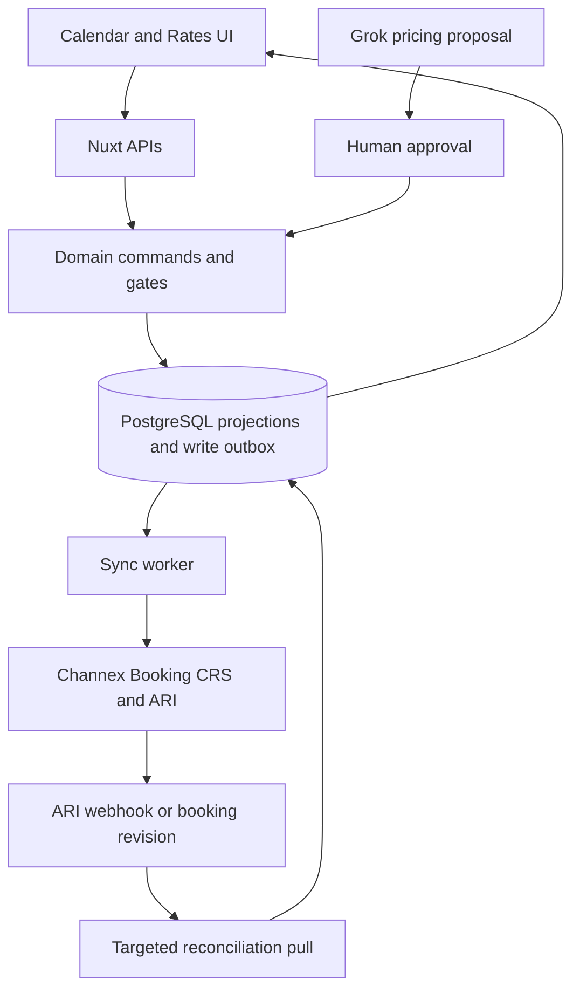
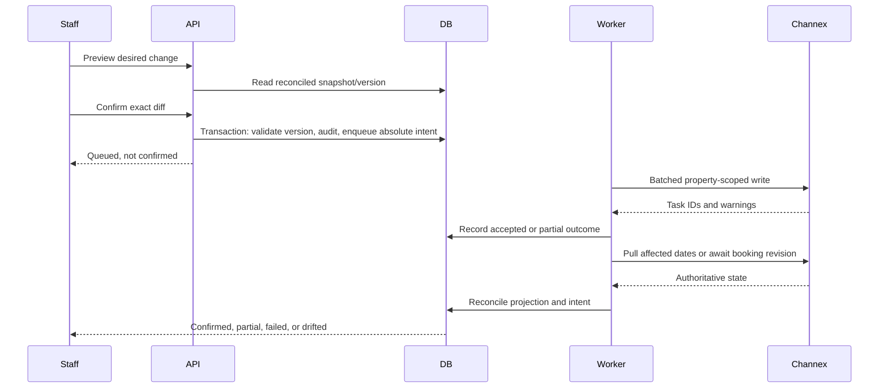
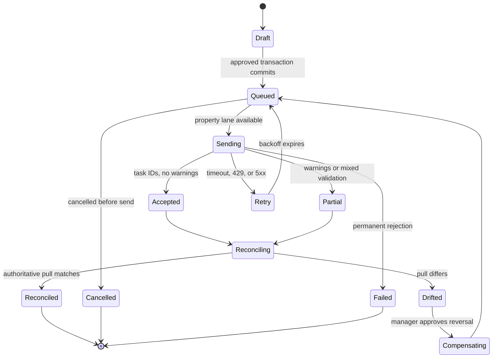

# Calendar ARI Editor - Plan

## Goal Capsule

- **Objective:** Turn Calendar from a reservation viewer into a Channex-authoritative workspace for vacancy, direct bookings, date operations, availability, prices, and restrictions.
- **Authority:** The confirmed scope and decisions in this plan override the earlier v1 deferral of ARI writes in `docs/plans/2026-07-16-001-feat-pms-os-platform-plan.md`; Channex remains authoritative for inventory, bookings, rates, and restrictions.
- **Execution profile:** Deep, cross-cutting work spanning PostgreSQL, domain commands, Channex sync, worker recovery, authorization, Calendar/Rate UI, and AI proposal approval.
- **Safety posture:** All external writes are durable, absolute desired-state intents; HTTP acceptance is not success until a Channex pull reconciles the expected state.
- **Stop conditions:** Stop and re-plan if sandbox testing cannot prove stable Booking CRS deduplication/reconciliation, if derived rate-plan modifiers cannot be updated without breaking inheritance, or if the available Channex credential cannot be scoped safely to the target network properties.
- **Tail ownership:** Implementation owns migrations, focused and full verification, sandbox contract evidence, rollout documentation, review, and the normal landing workflow.

---

## Product Contract

### Summary

PMS OS will add vacancy and day-cell operations first, then enable gated Channex writes for direct bookings, availability, prices, restrictions, derived rate-plan ratios, and human-approved Grok pricing proposals.

### Problem Frame

The current Calendar shows reservation bars but cannot answer how many units remain, create a safely synced booking from a cell, annotate a date, or display live ARI values.
The Rates surface uses fixture data and explicitly disables writes.
Hostex demonstrates the target workflow, but its listing-centric cell editor does not map directly to Channex: sellable inventory is room-type scoped, while prices and restrictions are rate-plan scoped.
Enabling edits without durable intent, warning handling, reconciliation, and property-scoped authorization would create double-sell and cross-tenant risk.

### Actors

- A1. Front-desk staff view vacancy, create direct bookings, and add date tasks or notes for accessible properties.
- A2. Managers perform availability, price, restriction, derived-rate, and approved AI pricing writes across accessible properties.
- A3. Organization administrators configure per-network write capabilities and canary rollout.
- A4. Channex accepts asynchronous Booking CRS and ARI writes and remains the external source of truth.
- A5. The sync worker drains durable intents, respects per-property limits, reconciles accepted writes, and reports drift.

### Requirements

#### Calendar read model

- R1. Calendar shows remaining vacancy for each room-type or single-unit property on every visible day using live Channex availability when fresh and reservation-derived capacity only as a visibly degraded fallback.
- R2. Calendar shows live nightly rates and applicable restriction indicators with source freshness; fixture rates remain test-only.
- R3. Hotel cells resolve to room types and rate plans while vacation-rental cells resolve to their single sellable room type.
- R4. Stale, partially mapped, or failed ARI pulls keep Calendar readable but disable affected writes and explain the missing prerequisite.

#### Cell operations

- R5. Front-desk staff can open an accessible day cell and create a direct booking with property, room type, arrival, departure, rate plan, daily prices, guest, and occupancy prefilled or validated.
- R6. Day-cell direct booking is available only when the Booking CRS capability is enabled and the property has the required Channex app; otherwise the Calendar action is hidden rather than implying a local-only booking.
- R7. Front-desk staff can create a property-scoped task due on the selected property-local date.
- R8. Front-desk staff can create, edit, and delete a lightweight PMS-owned date note independently of tasks and reservation notes.

#### Availability, prices, and restrictions

- R9. Managers can open or close room-type availability for one date or a date range, including multi-property selection with independent per-property outcomes.
- R10. Managers can edit parent/manual rate-plan prices and supported Channex restrictions: minimum stay on arrival, minimum stay-through, maximum stay, closed to arrival, closed to departure, and stop-sell.
- R11. Inherited child rates are not edited as nightly prices; the channel-ratio editor changes supported Channex derived rate-plan modifiers while channel mappings remain configured in Channex.
- R12. One user action may produce separate availability and restriction intents because Channex exposes them as different resources and rate-limit lanes.
- R13. Multi-property changes fan out into independently reconciled property intents; the UI never implies portfolio-wide atomicity.

#### External-write safety

- R14. Every booking or ARI mutation passes through shared domain commands with property scope, role checks, audit, persistent idempotency, stale-snapshot validation, and approval metadata.
- R15. A database transaction durably records the local projection change and external-write intent before any Channex request; process restart resumes unsent or unconfirmed work.
- R16. ARI writes use absolute desired values, serialize by property, batch within Channex limits, and retry rate limits, server errors, and unknown network outcomes without applying deltas twice.
- R17. Channex responses with warnings are partial outcomes, and accepted task IDs are pending until a targeted GET or booking revision confirms each affected resource.
- R18. Failed or divergent writes retain the last reconciled value, surface remediation, and support an audited compensating absolute write where reversal remains possible.
- R19. Property-local calendar dates, Channex inventory horizon, cut-off settings, rate-plan inheritance, and source freshness are validated before enqueue.

#### Permissions, rollout, and AI

- R20. Front desk may create bookings, tasks, and notes; manager or organization administrator is required for availability, prices, restrictions, derived modifiers, and Grok apply.
- R21. Booking CRS, availability writes, rate/restriction writes, derived-rate writes, and AI apply have independent per-network capability gates that default off.
- R22. A dry-run validates and previews the current-to-desired diff without enqueueing a Channex write.
- R23. Accepted Grok pricing proposals can be human-approved into the same stale-checked rate commands after manual rate writes pass the rollout gate; no autonomous AI send is introduced.
- R24. Calendar cell actions and status are keyboard accessible and usable in the mobile month view without drag-only interaction.

### Key Flows

- F1. Staff open Calendar, receive reservation plus ARI projections, and distinguish fresh values from stale or degraded fallbacks.
- F2. Front desk selects a cell, submits a direct booking, sees a durable pending state, and sees confirmation only after Channex revision reconciliation.
- F3. Staff select a cell to create a dated task or maintain a PMS-owned date note without contacting Channex.
- F4. A manager previews and submits availability or restriction changes; each property advances independently through queued, accepted, and reconciled states.
- F5. A manager edits a parent rate or derived modifier while inherited child values remain protected and channel mappings remain Channex-managed.
- F6. A manager approves a current Grok pricing proposal; stale proposals fail closed and must be regenerated or rebased.
- F7. A failed, warning-bearing, or drifting write exposes per-item outcomes and offers retry, cancel-before-send, or compensation where valid.

### Acceptance Examples

- AE1. Given a hotel room type with two physical rooms and one confirmed overlapping stay, when Calendar renders that day, then vacancy is one; a cancelled stay does not consume vacancy.
- AE2. Given Booking CRS is disabled for a network, when front desk opens an empty cell, then direct-booking creation is unavailable and no local reservation is created.
- AE3. Given a valid Booking CRS submission, when Channex accepts it but the revision has not arrived, then the booking remains pending; after the matching revision commits, it becomes confirmed with the Channex booking ID.
- AE4. Given one restriction row is valid and another produces a Channex warning, when the batch returns HTTP success, then the valid row may reconcile while the warned row remains partial and visible.
- AE5. Given another booking or staff write changes a targeted date after the editor loaded, when the original user submits, then the stale snapshot is rejected before enqueue and the editor refreshes.
- AE6. Given a queued availability close and a web restart, when the worker resumes, then it sends the same absolute payload once logically and reconciles the targeted date.
- AE7. Given a derived rate plan mapped to an OTA in Channex, when a manager changes its percentage modifier, then the modifier is updated and re-pulled while direct nightly editing of the inherited child remains disabled.
- AE8. Given a Grok proposal based on the latest reconciled snapshot, when a manager approves selected suggestions, then they enter the same rate-write lifecycle and are not marked applied before reconciliation.

### Success Criteria

- Calendar no longer depends on fixture rates in non-test environments.
- Every external write has a durable audit trail from intent through reconciliation.
- No write-enabled UI can bypass role, property, capability, or stale-snapshot gates.
- Availability and restriction batches stay within documented per-property limits and expose partial outcomes.
- The default production state remains read-only until a staged property passes the canary checklist.

### Scope Boundaries

#### In scope

- Vacancy counts, direct Booking CRS creation, dated tasks and notes, live ARI pulls, availability blocks, prices, supported restrictions, derived rate modifiers, multi-property fan-out, and human-approved Grok application.

#### Deferred to Follow-Up Work

- Booking CRS modification or cancellation of OTA-originated bookings.
- Automated drift repair beyond safe replay of a known desired-state intent.
- Channex channel mapping management; mappings continue in Channex because the Channel API is whitelabel-only.
- A general MCP/tool registry or natural-language calendar operator.

#### Outside this plan

- Hourly bookings, drag-to-resize reservations, payment collection, autonomous AI writes, and an alternative channel manager.

---

## Planning Contract

### Key Technical Decisions

- KTD1. **Channex remains authoritative.** PostgreSQL stores durable local projections, desired-state intents, and audit evidence; a write is complete only after re-pull or booking revision reconciliation.
- KTD2. **Persist normalized nightly projections.** Availability is keyed by network, property, room type, and date; rates/restrictions are keyed by network, property, rate plan, and date so Calendar range queries and stale checks do not depend on process memory.
- KTD3. **Use a transactional external-write outbox.** Domain authorization and validation produce a persistent absolute payload and projection mutation in one database transaction; the in-memory store updates only after commit.
- KTD4. **Partition execution per property and endpoint lane.** Availability and restrictions use separate queues and throttles because Channex permits ten requests per minute per property for each endpoint. Reconciliation GETs compete in the same ceiling, so each lane interleaves or batches targeted pulls with writes and reports write versus reconcile lag separately.
- KTD5. **Treat acceptance as asynchronous.** Store task IDs and warnings, then reconcile targeted dates by GET; ARI webhooks trigger pulls and never directly mutate the projection.
- KTD6. **Use optimistic snapshot versions.** Editors and AI proposals carry the last reconciled version; any changed targeted cell causes a hard refresh rather than an automatic merge.
- KTD7. **Make capability gates operational, not licensing entitlements.** Per-network flags separately control ARI read, availability, rate/restriction, derived-rate, Booking CRS, and AI apply, with command-side fail-closed enforcement.
- KTD8. **Keep Booking CRS isolated behind its beta gate.** Calendar creation is hidden when unavailable; the existing Reservations pending-sync path remains unchanged until CRS is proven and deliberately replaces it.
- KTD9. **Map Hostex concepts to Channex resources.** Open/close operates on room-type availability or rate-plan stop-sell as selected; prices and stay restrictions operate on rate plans, never on a generic listing cell.
- KTD10. **Model channel ratios as Channex derived rate-plan modifiers.** PMS edits supported modifier values and protects inherited child nightly rates; channel mappings remain configured in Channex.
- KTD11. **Fan out bulk actions without distributed atomicity.** Each property gets an independent intent and outcome; canceling or compensating one property does not rewrite successful siblings.
- KTD12. **Use property-local dates.** All date eligibility and “today” checks use the property IANA timezone and Channex inventory horizon rather than server UTC.
- KTD13. **Reuse domain commands for AI parity.** Human-approved Grok proposals call the same rate commands as the manual editor and preserve `accepted_local` when AI apply is disabled.
- KTD14. **Prefer compensation over rollback fiction.** A reconciled external change is reversed by a new absolute desired-state intent based on the last known-good projection.

### High-Level Technical Design

#### Component topology

#### Write and reconciliation sequence

#### External-write lifecycle

### Sequencing

1. Establish durable projections, outbox lifecycle, permissions, and capability gates before exposing writes.
2. Replace fixture ARI with live pull/reconciliation before direct booking or editing depends on prices and availability.
3. Ship vacancy and local date operations on the read model.
4. Prove Booking CRS separately because it is beta and has booking-specific revision semantics.
5. Canary availability writes before enabling rates/restrictions and derived modifiers.
6. Enable human-approved Grok application only after manual rate writes meet reconciliation and drift thresholds.

### System-Wide Impact

- **Data lifecycle:** ARI state and write evidence move from process memory/fixtures to durable PostgreSQL projections and outbox rows.
- **Authorization:** New privileged actions separate booking/task operations from availability/rate/AI mutations.
- **Worker:** A new outbound lifecycle runs alongside booking revision pull, ack outbox, message pull, and catalog import.
- **UI:** Calendar becomes a read/write workspace; Rates remains a detailed rate-plan view backed by the same commands and projections.
- **Mobile/accessibility:** Cell menus replace drag-only interaction and must retain keyboard, focus, and touch support.
- **Agent parity:** No new agent framework; manual UI and approved AI proposals share commands, audit, and reconciliation.

### Risks and Dependencies

- **Booking CRS beta behavior:** Duplicate-create semantics and eventual consistency are not fully documented. Mitigation: stable offline reservation code, sandbox contract tests, independent kill switch, no production enablement without reconciliation evidence.
- **Partial ARI success:** Channex can return HTTP success with warnings while applying valid rows. Mitigation: itemized warnings, targeted pulls, and no batch-level “success” state.
- **Double-sell during stale edits:** Bookings and staff writes can race. Mitigation: fresh snapshot version, per-property serialization, Channex-authoritative confirmation.
- **Derived rate inheritance:** Child writes may conflict with inherited parents. Mitigation: edit parent nightly prices, edit supported derived modifiers separately, and sandbox-test inheritance behavior.
- **Shared commercial credentials:** Group membership is not a write ACL. Mitigation: verify local network-property mapping and Channex property scope on every command; prefer restricted keys when operationally available.
- **Rate limits and backlog:** Bulk edits can exceed ten requests per minute per endpoint and property, and reconciliation GETs compete for the same ceiling. Mitigation: batching, coalescing latest absolute intent, separate lanes, interleaved or batched reconcile pulls, backoff, and lag metrics that separate write versus reconcile consumption.
- **Process-memory baseline:** Existing domain state is only partially durable. Mitigation: external-write projection and intent paths must use PostgreSQL transactions and cannot rely on restart-sensitive arrays.

### Sources and Research

- Existing authority and deferred scope: `docs/plans/2026-07-16-001-feat-pms-os-platform-plan.md` R9, R10, KTD6-KTD9, and KTD11.
- Existing patterns: `packages/domain/src/run.ts`, `packages/sync/src/jobs/process-ack-outbox.ts`, `packages/sync/src/jobs/pull-booking-revisions.ts`, `packages/sync/src/jobs/pull-messages.ts`, and `apps/web/server/utils/reservations.ts`.
- Channex ARI: https://docs.channex.io/api-v.1-documentation/ari
- Channex rate limits: https://docs.channex.io/api-v.1-documentation/rate-limits
- Channex PMS integration and certification: https://docs.channex.io/guides/pms-integration-guide and https://docs.channex.io/api-v.1-documentation/pms-certification-tests
- Channex Booking CRS beta: https://docs.channex.io/api-v.1-documentation/booking-crs-api
- Channex bookings/revisions: https://docs.channex.io/api-v.1-documentation/bookings-collection
- Channex rate plans/derived rates: https://docs.channex.io/api-v.1-documentation/rate-plans-collection
- Channex webhooks: https://docs.channex.io/api-v.1-documentation/webhook-collection
- Transactional outbox guidance: https://microservices.io/patterns/data/transactional-outbox.html and https://docs.aws.amazon.com/prescriptive-guidance/latest/cloud-design-patterns/transactional-outbox.html

---

## Implementation Units

### U1. Add durable ARI projections, write intents, and safety gates

- **Goal:** Establish the persistent state and command-side controls required before any Channex write is exposed.
- **Requirements:** R14-R22
- **Dependencies:** None
- **Files:** Modify `packages/db/src/schema.ts`, `packages/db/src/schema.test.ts`, `packages/auth/src/roles.ts`, `packages/auth/src/roles.test.ts`, `packages/domain/src/store.ts`, `packages/domain/src/run.ts`, `packages/domain/src/permissions.test.ts`, and `apps/web/server/utils/operations.ts`; create a generated migration under `packages/db/migrations/` and focused persistence helpers/tests under `apps/web/server/lib/`.
- **Approach:** Add normalized nightly availability and restriction projections, calendar notes, operational capability settings, and a persistent external-write intent/outbox with idempotency key, resource scope, absolute desired payload, base snapshot version, lifecycle status, task IDs, warnings, retry metadata, actor/approver, and compensation linkage. Add privileged actions for ARI and AI application. Keep operational flags separate from commercial entitlements and default every write class off.
- **Execution note:** Start with schema and permission tests; prove that projection mutation plus outbox insertion commits or rolls back as one transaction before adding a sender.
- **Patterns to follow:** `ack_outbox`, `sync_health`, `audit_events`, `network_entitlements`, `packages/domain/src/run.ts`, and command risk metadata.
- **Test scenarios:**
  - Gate-off commands fail for every role and create no projection or intent rows.
  - Front desk may create booking/task/note intents but cannot enqueue availability, rates, restrictions, derived modifiers, or AI apply.
  - Manager may enqueue ARI writes only for accessible properties and org admin may change network capability settings.
  - Reusing an idempotency key returns the original logical result and creates one outbox row.
  - A forced transaction failure leaves neither a projection change nor an outbox row.
  - Restart hydration preserves queued, retry, accepted, partial, and drifted states.
- **Verification:** Migrations apply from a clean database; command-side gates remain authoritative when routes or UI are bypassed; durable intents survive process restart.

### U2. Replace fixture rates with live Channex ARI pull and reconciliation

- **Goal:** Build the authoritative read path that all vacancy, price, restriction, and stale-write decisions depend on.
- **Requirements:** R1-R4, R17, R19
- **Dependencies:** U1
- **Files:** Modify `packages/sync/src/channex/client.ts`, `packages/sync/src/channex/types.ts`, `packages/sync/src/channex/client.test.ts`, `packages/sync/src/worker.ts`, `packages/sync/src/index.ts`, `apps/web/server/utils/sync.ts`, `apps/web/server/utils/revenue.ts`, `packages/domain/src/rates/read-model.ts`, `apps/web/server/api/rates/index.get.ts`, and `apps/web/tests/revenue/revenue-flow.test.ts`; create `packages/sync/src/jobs/pull-ari.ts`, `packages/sync/src/jobs/pull-ari.test.ts`, and an opt-in Channex sandbox contract test.
- **Approach:** Pull availability by room type and restrictions by rate plan for one property/range, normalize them into PostgreSQL with a monotonic snapshot version and freshness metadata, and use ARI webhooks only to enqueue targeted pulls. Replace non-test fixture reads with the projection. Retain fixtures only as explicit test data.
- **Execution note:** Characterize the current fixture response contract first, then make the live projection satisfy it before removing runtime fixture fallback.
- **Patterns to follow:** `pull-messages.ts` for lease/property scope, `pull-booking-revisions.ts` for reliability, sync health redaction, and current rates payload projection.
- **Test scenarios:**
  - Pulling two room types and two rate plans persists normalized dates, rates, restrictions, source timestamps, and one new snapshot version.
  - A concurrent lease holder causes a skip without duplicate rows or cursor movement.
  - A partial property/rate-plan mapping records a degraded freshness state and leaves the affected editor read-only.
  - Re-pulling unchanged values does not create a false version change.
  - Cross-network property data from a master key is rejected.
  - An ARI webhook triggers a pull; out-of-order or duplicate webhook delivery does not directly overwrite projection values.
  - Sandbox: GET values match known Channex property fixtures for availability, rate, minimum stays, CTA/CTD, maximum stay, and stop-sell.
- **Verification:** Production rate APIs no longer return fixture-origin data; targeted pulls are idempotent, property-scoped, freshness-aware, and usable for reconciliation.

### U3. Add vacancy, rate overlays, freshness, and cell action shell

- **Goal:** Surface the new read model in Calendar and establish a reusable accessible cell interaction without enabling unsafe writes.
- **Requirements:** R1-R4, R24, AE1
- **Dependencies:** U2
- **Files:** Modify `apps/web/server/lib/reservation-query.ts`, `apps/web/server/api/reservations/index.get.ts`, `apps/web/app/pages/calendar.vue`, `apps/web/app/components/calendar/CalendarGrid.vue`, `apps/web/tests/calendar/calendar-grid.test.ts`, and `apps/web/tests/reservations/reservations-flow.test.ts`; create `apps/web/app/components/calendar/CalendarCellMenu.vue`.
- **Approach:** Project each visible row/date with capacity, reconciled availability, vacancy, representative parent/manual rate, restriction markers, and freshness. Use Channex availability when fresh; label reservation-derived vacancy as degraded rather than presenting it as authoritative. A click, keyboard activation, or touch opens the same cell menu.
- **Patterns to follow:** Existing half-open stay overlap, hotel/room-type grouping, mobile month layout, `SyncStatusBadge`, and native button/menu semantics.
- **Test scenarios:**
  - Covers AE1. Capacity two with one overlapping confirmed stay renders one vacancy.
  - Check-out day does not consume vacancy; cancelled reservations do not consume it; pending-sync policy is visible and consistent.
  - Fresh Channex availability overrides reservation-derived capacity while stale data shows a degraded label.
  - Missing room/rate mapping disables only actions requiring the missing resource.
  - Keyboard Enter/Space, Escape, focus return, and mobile tap open and close the cell menu without drag.
  - Property filter and 14/31-day/month layouts retain correct row/date alignment with overlays.
- **Verification:** Staff can scan vacancy, rate, restrictions, and freshness at Calendar-cell level on desktop and mobile without any write capability being enabled.

### U4. Add property-date tasks and notes

- **Goal:** Deliver the PMS-owned day-cell actions without coupling them to Channex.
- **Requirements:** R7, R8, R14, R20, R24
- **Dependencies:** U1, U3
- **Files:** Modify `packages/domain/src/store.ts`, `packages/domain/src/commands/create-task.ts`, `packages/domain/src/commands.test.ts`, `apps/web/server/api/tasks/index.post.ts`, `apps/web/app/pages/tasks.vue`, `apps/web/app/components/calendar/CalendarCellMenu.vue`, and `apps/web/tests/operations/operations-flow.test.ts`; create date-note commands and routes under `packages/domain/src/commands/` and `apps/web/server/api/calendar/notes/` with focused tests.
- **Approach:** Carry the existing task `dueDate` through domain/API/UI and prefill it from the property-local cell date. Implement a small property/date-scoped note entity rather than overloading reservation staff notes or property-wide notes. Notes remain separately editable and auditable.
- **Execution note:** Implement date-note command behavior test-first; reuse the task path rather than adding a calendar-specific task model.
- **Patterns to follow:** `createTask`, reservation notes, property scope checks, audit events, and current task filters.
- **Test scenarios:**
  - Front desk creates a task due on the selected property-local date and it appears in Tasks with the correct property.
  - A note can be created, edited, loaded with Calendar, and deleted without creating a task.
  - Two notes on different properties or dates never collide.
  - Out-of-scope property mutations are denied and audited.
  - A timezone near UTC midnight preserves the selected local date.
- **Verification:** Tasks and notes created from Calendar are durable, scoped, visible in their owning surfaces, and require no Channex connectivity.

### U5. Add gated Booking CRS direct creation and reconciliation

- **Goal:** Replace the Calendar’s unsafe local-only implication with a beta-gated Channex direct-booking flow.
- **Requirements:** R5, R6, R14-R21, AE2, AE3
- **Dependencies:** U1, U2, U3
- **Files:** Modify `packages/sync/src/channex/client.ts`, `packages/sync/src/channex/types.ts`, `packages/sync/src/channex/client.test.ts`, `packages/domain/src/commands/create-direct-reservation.ts`, `packages/domain/src/reservations.test.ts`, `apps/web/server/utils/reservations.ts`, `apps/web/app/components/reservations/DirectBookingForm.vue`, `apps/web/app/components/calendar/CalendarCellMenu.vue`, `apps/web/app/pages/calendar.vue`, and `apps/web/tests/reservations/reservations-flow.test.ts`; add a Booking CRS sandbox contract test.
- **Approach:** Extend the existing direct-booking command and form rather than create a second reservation pipeline. Require property, room type, rate plan, daily prices, guest, and occupancy needed by Booking CRS. Persist the reservation intent and booking outbox atomically, use a stable offline reservation code for reconciliation, and keep status pending until the matching booking revision commits. Hide cell creation when the app/capability is absent.
- **Execution note:** Verify duplicate-create behavior and eventual consistency in Channex staging before enabling the sender outside tests.
- **Patterns to follow:** Existing pending-sync visibility, booking revision apply/ack-after-commit, property mapping safeguards, and compensating risk metadata.
- **Test scenarios:**
  - Covers AE2. Capability or CRS app absent hides cell create and server-side submission fails closed.
  - Required Booking CRS fields are populated from the selected room/rate/date context and invalid occupancy/date ranges are rejected before enqueue.
  - Covers AE3. HTTP acceptance remains pending until the matching revision persists.
  - Double-submit with one idempotency key produces one logical booking and one stable offline code.
  - Timeout after send resumes reconciliation rather than blindly creating a second booking.
  - A competing booking that removes vacancy causes stale-submit rejection.
  - Cross-property room type or rate plan IDs are rejected.
  - Sandbox: create an Offline booking, observe eventual revision/unique ID, and verify availability side effects.
- **Verification:** A Calendar-created booking either confirms from Channex or remains visibly recoverable; it never silently becomes a confirmed local-only reservation.

### U6. Implement availability close/open through the outbox

- **Goal:** Deliver the first production-gated ARI mutation with full warning, retry, reconcile, and compensation behavior.
- **Requirements:** R9, R12-R22, AE4-AE6
- **Dependencies:** U1, U2, U3
- **Files:** Create an availability domain command and tests under `packages/domain/src/commands/`; create `packages/sync/src/jobs/process-ari-write-outbox.ts` and tests; modify `packages/sync/src/worker.ts`, `packages/sync/src/sync-health.ts`, `apps/web/server/utils/sync.ts`, `apps/web/app/components/calendar/CalendarCellMenu.vue`, `apps/web/app/pages/calendar.vue`, and calendar/API flow tests.
- **Approach:** Preview room-type/date-range absolute availability, validate a fresh base version, and fan out one intent per property. The worker batches availability separately, coalesces superseded queued values, honors per-property throttling, stores warnings/tasks, and pulls targeted dates until reconciled. Open restores an explicit desired value rather than applying a delta.
- **Execution note:** Start with command/outbox failure tests, including restart and warning paths, before adding the Calendar Save control.
- **Patterns to follow:** Ack outbox processing, worker health files, lease handling, command approval/audit, and status badges.
- **Test scenarios:**
  - Gate off and front-desk attempts fail before enqueue.
  - A manager previews and closes one room type across a valid range, producing one absolute intent and pending UI.
  - Covers AE4. Mixed warnings produce per-item partial state instead of batch success.
  - Covers AE5. A changed snapshot version rejects submission and refreshes the preview.
  - Covers AE6. Restart resumes the same intent and reconciles once without delta duplication.
  - Two queued changes for the same resource/date coalesce safely before send; an already accepted change is not silently overwritten.
  - A multi-property request produces independent outcomes and preserves successful siblings when one property fails.
  - A compensating reopen is a new audited intent based on the last reconciled value.
- **Verification:** One canary property can close and reopen availability in staging and reconcile exact values; production remains off by default.

### U7. Add price, restriction, and derived-rate modifier editing

- **Goal:** Complete the Hostex-style editor using Channex rate-plan semantics instead of a generic per-channel ratio field.
- **Requirements:** R10-R13, R14-R22, AE4, AE5, AE7
- **Dependencies:** U1, U2, U3, U6
- **Files:** Modify `packages/domain/src/rates/read-model.ts`, `apps/web/server/api/rates/index.get.ts`, `apps/web/app/pages/rates.vue`, `apps/web/app/components/rates/RatePlanTable.vue`, `apps/web/app/pages/calendar.vue`, `apps/web/tests/revenue/revenue-flow.test.ts`, `packages/sync/src/channex/client.ts`, and client tests; create rate/restriction/derived-modifier commands and tests plus `apps/web/app/components/calendar/CalendarAriDrawer.vue`.
- **Approach:** Use one drawer with Availability, Price, and Restrictions tabs, but map saves to separate commands and outbox lanes. Permit nightly edits only on parent/manual plans. Expose derived modifier editing for supported Channex plans and show channel mapping as Channex-managed metadata with a session link. Store money canonically in minor units and serialize Channex-compatible decimal values at the client boundary.
- **Execution note:** Characterize rate inheritance and warning behavior in staging; fail closed for any rate-plan mode not proven by contract tests.
- **Patterns to follow:** Existing Rates read model, OTA session handoff, money helpers, ARI availability lifecycle, and property-scoped bulk fan-out.
- **Test scenarios:**
  - Parent/manual nightly price changes reconcile for the selected dates and currency.
  - Minimum arrival/through stay, maximum stay, CTA, CTD, and stop-sell round-trip independently and in a valid combined batch.
  - A past date, non-positive rate, invalid stay range, or date beyond inventory horizon fails before enqueue.
  - Covers AE7. Derived modifier updates reconcile while inherited child nightly price input remains disabled.
  - Missing channel mapping shows a Channex-management action and cannot be mistaken for a saved PMS ratio.
  - Covers AE4 and AE5 for warning-bearing and stale rate batches.
  - Multi-property bulk edits report per-property queued, reconciled, partial, or failed outcomes.
  - Keyboard and mobile users can review the exact diff and submit without relying on hover or drag.
- **Verification:** Managers can safely edit every supported price/restriction field and derived modifier against a canary property; unsupported Channex semantics remain visibly read-only.

### U8. Apply approved Grok pricing through shared rate commands

- **Goal:** Give AI proposals command parity without allowing autonomous Channex writes.
- **Requirements:** R14-R23, AE8
- **Dependencies:** U7
- **Files:** Modify `apps/web/server/api/ai/pricing/suggest.post.ts`, `apps/web/server/api/ai/pricing/[id]/accept.post.ts`, `apps/web/server/lib/ai-proposals.ts`, `apps/web/server/utils/ai-context.ts`, `apps/web/app/pages/rates.vue`, and `apps/web/tests/ai/ai-features.test.ts`.
- **Approach:** Bind proposals to reconciled snapshot versions and exact rate-plan/date suggestions. Preserve local acceptance when AI apply is disabled; when enabled, require manager approval of selected suggestions and enqueue the same rate command used by the manual editor. Track queued, reconciled, partial, failed, and stale outcomes separately from proposal generation.
- **Execution note:** Add stale-proposal and exact-payload approval tests before wiring the approval button.
- **Patterns to follow:** Ops schedule approval’s partial selection, AI proposal schemas, automation approval privilege, and U7 rate commands.
- **Test scenarios:**
  - Covers AE8. A fresh proposal with selected rows enters the shared outbox and becomes applied only after reconciliation.
  - A stale snapshot, disabled capability, out-of-scope property, or non-manager approval creates no intent.
  - Explicit empty selection applies nothing; omitted selection follows the UI’s explicit all/none contract.
  - Partial Channex warnings map back to individual proposal rows.
  - Proposal generation never sends or queues a write.
- **Verification:** AI and manual price changes have identical authorization, validation, audit, stale-check, and reconciliation behavior; no auto-send path exists.

### U9. Add operational health, canary rollout, and recovery documentation

- **Goal:** Make ARI and Booking CRS writes observable, reversible where possible, and safely deployable.
- **Requirements:** R17-R23
- **Dependencies:** U5-U8
- **Files:** Modify `apps/web/app/components/sync/SyncHealthPanel.vue`, `packages/sync/src/sync-health.ts`, `packages/sync/src/sync-health.test.ts`, `apps/web/server/api/sync/status.get.ts`, `docs/deployment/channex-webhooks.md`, `docs/deployment/launch-checklist.md`, `docs/deployment/rollback.md`, and `docs/deployment/verification-queries.md`.
- **Approach:** Report per-property outbox lag, write versus reconcile lag, warning rate, retry/429 count, accepted-to-reconciled latency, drift count, and oldest pending booking revision. Document staging proof, one-property production canary, write-class expansion, kill switches, and compensation. Add a bounded nightly drift pull that only detects and reports drift, or queues a human-approved safe replay of an existing desired-state intent, and never performs autonomous corrective writes.
- **Execution note:** Prefer runtime/sandbox verification over synthetic unit coverage for rollout documentation, while keeping health aggregation under focused tests.
- **Patterns to follow:** Existing sync-health redaction, launch checklist stop gates, backup/migrate/health order, and rollback documentation.
- **Test scenarios:**
  - Health API reports lag and warning/drift counts without exposing guest data, API keys, or raw payload secrets.
  - A stuck accepted intent crosses the alert threshold and identifies network/property/resource scope.
  - Disabling one write class stops new intents while reconciliation and safe retries for existing intents continue.
  - A canary rollback queues compensation where possible and documents irreversible OTA side effects.
  - Nightly drift pull detects mismatch without overwriting an unresolved staff intent.
- **Verification:** Operators can decide whether to expand, pause, retry, or compensate a canary from health data and documented queries; all production write gates remain independently reversible.

---

## Verification Contract

| Gate | Applies to | Required outcome |
|---|---|---|
| `pnpm --filter @pms/db test` | U1, U4 | Schema relationships, uniqueness, and migration expectations pass. |
| `pnpm --filter @pms/auth test` | U1 | Role and privileged-action matrix matches R20. |
| `pnpm --filter @pms/domain test` | U1, U4-U8 | Commands prove scope, risk, idempotency, stale checks, approval, and no bypass paths. |
| `pnpm --filter @pms/sync test` | U2, U5-U7, U9 | Client contracts, pulls, batching, retries, warnings, reconciliation, and health pass. |
| `pnpm --filter @pms/web test` | U2-U9 | Calendar, reservations, operations, rates, AI, and sync API flows pass. |
| `pnpm typecheck` | All | Workspace typecheck introduces no new errors; existing baseline errors are separately recorded and not widened. |
| `pnpm lint` | All | Configured workspace lint checks pass. |
| `pnpm --filter @pms/web build` | U3-U9 | Nuxt production build completes without client/server boundary regressions. |
| Channex staging contract suite | U2, U5-U7 | Pull/write/reconcile behavior, warning semantics, rate limits, Booking CRS dedupe, and derived inheritance are evidenced against staging. |
| Manual desktop/mobile/keyboard smoke | U3-U8 | Calendar overlays, menus, drawer, pending/partial states, and focus behavior match the acceptance examples. |
| Production canary checklist | U9 | One scoped property proves each enabled write class before broader rollout; default-off and kill-switch behavior are verified. |

### Cross-Unit Scenarios

- A Calendar close writes room-type availability, not a generic property flag; a price/restriction change writes rate-plan restrictions, and both reconcile independently.
- A direct booking accepted by Booking CRS but not yet present in revisions stays pending across a restart and does not decrement local vacancy twice.
- A bulk edit over two properties can reconcile one and fail the other without presenting the entire action as rolled back or confirmed.
- A Channex UI change between preview and submit invalidates the local snapshot and prevents a stale manager or AI write.
- A warning-bearing 200 response cannot advance an intent to reconciled without a matching GET.
- Disabling a write class mid-backlog blocks new commands but allows safe recovery of already accepted external work.

---

## Definition of Done

- R1-R24 and AE1-AE8 are covered by implementation and named verification evidence.
- Normal Calendar loads live ARI projections and never uses runtime fixture rates.
- Vacancy, task, note, direct booking, availability, rate, restriction, derived modifier, bulk, and AI approval flows reach truthful terminal states.
- Every external write is durable before send, property-scoped, idempotent, stale-checked, audited, throttled, warning-aware, and reconciled from Channex.
- Booking CRS and every ARI write class default off and can be enabled or disabled independently per network.
- Channex staging contract evidence covers the documented unknowns before corresponding production gates can turn on.
- Desktop, mobile, and keyboard smoke checks pass without drag-only actions.
- Full tests, typecheck baseline comparison, lint, and production build meet the Verification Contract.
- Deployment, health, canary, compensation, and rollback documentation is current.
- Abandoned experiments, fixture runtime paths, duplicate write pipelines, and dead feature-flag branches are removed before landing.
