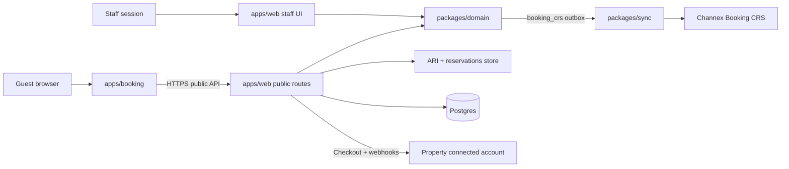
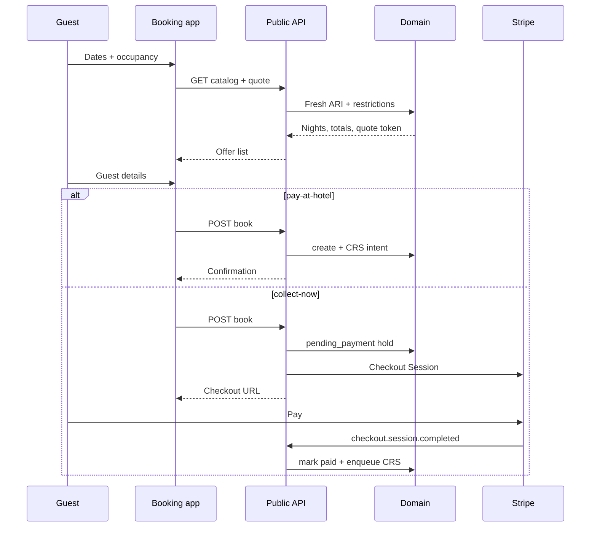
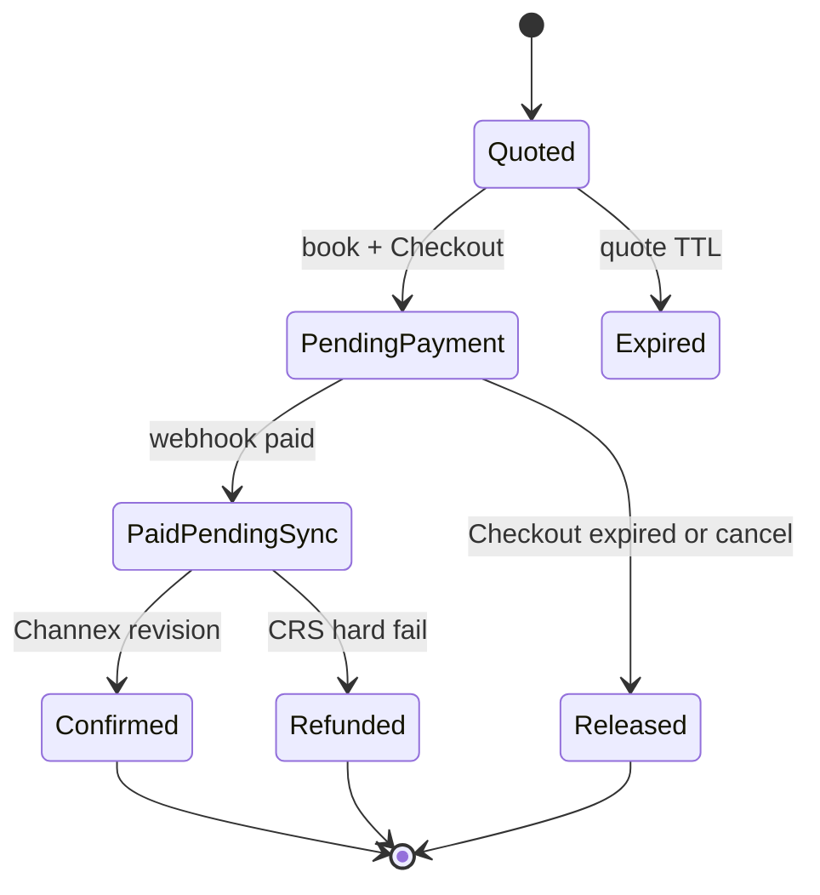

# Public hotel booking engine - Plan

**Target repo:** this tree (`pms-os`). Paths below are repo-relative.
**Live apply:** `pms-os` compose on mia (`web` plus a new `booking` sidecar). Do not overwrite leftover OpenPanel `docker-compose.yml`. Do not import `@pms/*` into `apps/website`.
**Product Contract preservation:** created in this run (`ce-plan-bootstrap`).

## Goal Capsule

Ship a dedicated public booking site where a guest picks dates, sees a server-computed stay quote, enters guest details, and creates a Channex-backed reservation. Operators set advance collection (percent, fixed, full, or pay-at-hotel). Terms snapshot onto the booking. The property's Stripe account charges when the policy is not pay-at-hotel.

**Authority hierarchy:** This plan → existing `createDirectReservation` + Booking CRS + ARI projections → website isolation (`apps/website` stays marketing-only) → OpenPanel Caddy/Coraza (exclusions after logged 403s, never global WAF off).

**Execution profile:** Test-first on public quote/book/payment contracts. Isolation script is the booking-app gate. Origin smoke after compose/Caddy, not HTTP 200 alone.

**Stop conditions:** Do not put booking UI or Nitro POSTs on `apps/website`. Do not let guests submit prices. Do not book from stale or missing ARI. Do not confirm a paid stay from Checkout `success_url` alone. Do not use platform Stripe for guest charges. Do not add villa marketplace, promo codes, experiences, galleries, or SEO as this plan. Do not claim POS, MCP, or tax packs on the booking site.

**Tail ownership:** No secrets in the plan or commits. Stripe and DB credentials stay in env. Guest PII stays out of Stripe metadata and application logs.

---

## Product Contract

### Summary

Guests book one hotel room type on a dedicated site. The PMS computes availability and price. Pay-at-hotel bookings create a reservation immediately. Collect-now bookings occupy inventory, take payment on the property's Stripe, then push Booking CRS. Staff see the reservation on the existing calendar.

### Problem Frame

Staff can create a direct reservation only while signed in. There is no public quote, no guest email on create, and no property payment path. The marketing site cannot import domain code and Coraza has blocked POSTs there. Operators still need a guest-facing engine with live availability and configurable collection.

### Requirements

#### Guest booking

- R1. A guest opens a public property booking URL, picks check-in and check-out, and sees live room-type availability with a server-computed stay quote.
- R2. The guest enters name, email, and adult count (at least 1, not above room capacity), reviews snapshotted terms, and books one room type for those dates. Children and infants are not collected in v1.
- R3. The guest never submits a price, deposit amount, or collection type. The server owns those values.
- R4. Public book fails closed when Channex ARI is missing or older than one hour for any stay night.
- R5. Public book enforces stop-sell, min stay, and CTA/CTD restrictions that the calendar already displays.
- R6. Public book is capped at the ARI pull horizon (90 days) and check-in on or after the property-local today.
- R7. After submit, the guest sees a confirmation page for that booking. Pay-at-hotel and collect-now both stay "received, confirming" until Channex revision confirms. Do not present `pending_sync` as a confirmed stay.

#### Collection and money

- R8. The operator sets per-property collection to percent, fixed amount, full stay, or pay-at-hotel, and can edit terms text. `(session-settled: user-directed — chosen over pay-at-hotel-only and always-deposit: operator wants configurable advance collection)`
- R9. At book time the PMS copies the active policy, computed deposit, stay total, currency, and terms into an immutable snapshot on the reservation.
- R10. Pay-at-hotel creates the reservation without a card charge and still writes R9.
- R11. Percent, fixed, and full charge the **property's** Stripe account for the snapshotted deposit. `(session-settled: user-directed — chosen over snapshot-only and platform Stripe: property is merchant of record)`
- R12. A collect-now booking occupies inventory before Checkout. Abandoned or expired Checkout releases it. CRS hard failure after a successful charge refunds the guest.

#### Operator and staff

- R13. Staff enable public booking only when `bookingCrsWrite` is on and the property has mapped room types and parent/manual rate plans.
- R14. Staff connect the property Stripe account and see whether charges are enabled before collect-now is offered.
- R15. Staff see public bookings on the existing reservations list and calendar, including guest email and snapshotted totals.
- R16. Archived slugs return not-found. Unmapped properties, CRS write off, or no saved collection policy return not-ready (not an empty false success).
- R19. When the property is ready per R16, staff booking settings show a copyable public booking URL. The operator copies that URL; they do not configure the hostname in-app.

#### Surface

- R17. Guests book on a dedicated booking site, not `pms.do` marketing pages and not the staff app as the product home. `(session-settled: user-directed — chosen over a guest path on the staff app and booking UI on the marketing site: isolation and Coraza history)`
- R18. The booking site talks to the PMS over HTTP only. It does not import `@pms/*`.

### Actors

- A1. Hotel guest on the public booking site.
- A2. Property operator configuring policy, Stripe, and the public URL.
- A3. Front-desk staff operating the reservation after it lands.
- A4. Implementer deploying `web` + `booking` on mia.

### Key Flows

- F1. Quote — A1 picks dates → public catalog + quote → room types with per-night prices or a sold-out / refresh-dates error.
- F2. Pay-at-hotel — A1 submits guest details → reservation `pending_sync` → confirmation page that says received, confirming (R7).
- F3. Collect-now — A1 submits → inventory occupied → Stripe Checkout on the property account → webhook or reconcile confirms payment → confirmation page (R7).
- F4. Operator ready — A2 saves a collection policy and confirms CRS mapping. Stripe onboarding is required only when the live policy is collect-now. A2 copies the public URL from settings (R19).
- F5. Staff follow-up — A3 opens the reservation after F2 or F3; email and snapshot are visible.

### Acceptance Examples

- AE1. Covers F1 / R1 / R4. Fresh ARI, two vacant nights, parent rate plan: quote returns per-night amounts and a quote token. Stale ARI: quote returns not-available, not a degraded staff-style vacancy.
- AE2. Covers F2 / R10 / R9. Pay-at-hotel book persists guest email, snapshot `collection_type: pay_at_hotel`, and a CRS intent. No Stripe session.
- AE3. Covers F3 / R11 / R12. Collect-now: Checkout `success_url` alone does not mark paid. `checkout.session.completed` with `payment_status=paid` does. Expired session cancels the pending reservation.
- AE4. Covers R3. Tampered body with a lower deposit is ignored. Server recomputes from the quote token.
- AE5. Covers R5. Stop-sell on one stay night: quote omits that room type. Book with a stale token for that type returns conflict and tells the guest to re-quote.
- AE6. Covers R16. Archived property slug returns not-found. CRS off or missing policy returns not-ready.

### Success Criteria

- A guest can complete F2 on a mapped property with pay-at-hotel without a staff session.
- A guest can complete F3 when the property Stripe account has `charges_enabled`.
- Domain and web tests cover AE1–AE6.
- `apps/booking` isolation script passes. `apps/website` isolation is unchanged.

### Key Decisions

- Dedicated booking site is the guest product. Marketing stays isolated. Staff app hosts public APIs, not the guest UI. Governs R17, R18.
- Collection is operator-configurable and snapshotted. Governs R8, R9, R10.
- Property Stripe is merchant of record for collect-now. Governs R11, R12, R14.

### Scope Boundaries

#### In scope

- One room per booking, parent/manual rate plans, 90-day horizon, email required.
- Public catalog, quote, book, Stripe Connect onboarding, Checkout, webhook fulfillment.
- Dedicated `apps/booking` app and compose/Caddy wiring.

#### Deferred for later

- Photo galleries, policies/FAQ CMS, promo codes, experiences/add-ons, brand-color theming, schema.org/OG SEO.
- Villa marketplace, instant-book vs request-to-book, multi-room carts.
- Guest self-cancel, confirmation email pipeline, children pricing rules.
- Separate `publicBookingEnabled` flag (v1 reuses `bookingCrsWrite`).
- Network-level property picker landing.

#### Outside this product's identity

- Restaurant POS, WhatsApp, country tax packs, MCP tools.
- Staff Today board / check-in flow.
- Platform Stripe taking guest money.
- Booking UI or quote POST on `apps/website`.

#### Deferred to Follow-Up Work

- Guest transactional email on `confirmed`.
- Application fee to the platform.
- Derived rate-plan inheritance on the public quote.
- Soft inventory hold table if pending reservations prove too coarse.

---

## Planning Contract

### Assumptions

- Production hostname defaults to `book.pms.do` with path `/{networkSlug}/{propertySlug}`. Operator can change the host at deploy time.
- Stripe country support for the property's country is verified during U4. Dominican Republic properties may need a documented fallback to pay-at-hotel only.
- PG persist and hydrate for reservations is **new work**, not an existing write-through. `apps/web/server/utils/reservations.ts` today keeps rows in-process. U3 must write reservation + intent + idempotency key before HTTP 201 and hydrate `DomainStore.reservations` on first network touch.

### Key Technical Decisions

- KTD1. New isolated Nuxt app `apps/booking` (`@pms/booking`) calls `apps/web` public HTTP routes. No `@pms/*` in the booking app. `(session-settled: user-directed — chosen over guest pages in apps/web and booking UI on apps/website: R17, R18)`
- KTD2. Public API lives on `apps/web` under `/api/public/booking/*`. No staff session. Resolve `{networkSlug, propertySlug}` server-side. Never require the guest to send `networkId` or Channex UUIDs.
- KTD3. Server computes the stay quote from projected ARI rates for the selected parent/manual plan. Guest prices are rejected. Pattern: invert `DirectBookingForm.vue` client `days` math.
- KTD4. Quote token is an HMAC-signed server token (secret from env) over property, dates, room type, rate plan, occupancy, `baseSnapshotVersion`, nights, currency, and computed stay/deposit amounts. TTL 15 minutes. Book verifies the MAC then re-validates vacancy and restrictions (R4, R5). Reject unsigned JSON blobs. A token without a reservation row is enough for pay-at-hotel. Collect-now still needs KTD5 because Checkout lasts longer than a re-check.
- KTD5. Public vacancy is the minimum of fresh ARI and remaining capacity after local non-cancelled stays, including `pending_payment` and `pending_sync`. Pay-at-hotel creates immediately with CRS outbox on. Collect-now creates `pending_payment` (counts toward that vacancy), defers CRS until paid, and sets Checkout `expires_at` and the release TTL to **30 minutes**. Chosen over quote-token-only for paid stays: another guest can take the room during Checkout. A local row does **not** block OTAs; enqueue a reversible `availabilityWrite` decrement for the Checkout window and reverse it on expire, cancel, or paid CRS. Staff `assertRoomTypeVacancy` must use the same merged rule so staff see the hold.
- KTD6. Collect-now uses Stripe Checkout Session in `payment` mode as a **direct charge** on the connected property account (`stripeAccount`). Immediate capture only. Refund on CRS hard failure (R12). Do not use manual capture. Confirm payment from a signed Connect webhook **or** a retrieve-session reconcile that applies the same checks. Fulfill only when the event's session id, `event.account`, and `amount_total` match the hold stored at session create. Do not fulfill on metadata ids alone. `(session-settled: user-directed — chosen over platform charges: R11)`
- KTD7. New Connect onboarding is Accounts v2 / current Connect onboarding, not legacy Standard OAuth. Platform SaaS billing in `apps/web/server/utils/billing.ts` stays unchanged.
- KTD8. Payment terms persist as JSON on the reservation row. Cancellation and refund math read the snapshot, not the live policy (R9).
- KTD9. Extend `createDirectReservation` (or a thin public wrapper) to persist `guestEmail`, `totalAmountMinor`, `paymentCollect`, and the terms snapshot. Send `customer.mail` on the CRS payload.
- KTD10. Booking app and public POSTs get explicit CORS allowlist and Coraza exclusions only after logged 403s. Do not set `routeRules` CORS to `*`.
- KTD11. Public writes are rate-limited: 60 quote/min and 10 book/min per IP per property. Do not rate-limit the Connect webhook. Guest payload is a strict allowlist (Zod 4 `strictObject`). Idempotency key on book is persisted with the reservation. Quote tokens are single-use after a successful book.
- KTD12. Public book and webhook fulfillment call `runCommand` through `buildPublicBookingPrincipal(networkId)`: `actorKind: 'user'`, reservations/payments access, property-scoped. Do not use `automation` (approval hold). Do not forge a staff session.
- KTD13. Confirmation lookup is a 128-bit random token, not the serial reservation id and not `offlineReservationCode`. `GET /api/public/booking/confirmation/[token]` returns status, dates, room type, snapshotted totals, and masked email only.

### High-Level Technical Design

#### Components



#### Quote to book



#### Collect-now states



### Output Structure

```text
apps/booking/
  app/pages/[networkSlug]/[propertySlug]/index.vue
  app/pages/[networkSlug]/[propertySlug]/checkout.vue
  app/pages/confirmation/[id].vue
  server/   (optional BFF proxy only; no Stripe secrets)
  scripts/verify-isolation.mjs
  nuxt.config.ts
  package.json
apps/web/server/api/public/booking/
  catalog.get.ts
  quote.post.ts
  book.post.ts
  confirmation/[token].get.ts
  stripe-connect/webhook.post.ts
apps/web/app/pages/settings/booking.vue   (or settings section)
```

The implementer may adjust filenames. Unit `Files` lists stay authoritative.

### Implementation Constraints

- Zod 4: `safeParse`, `strictObject`, `z.email()`, `z.treeifyError`. Do not use Zod 3 `message` / `.format()`.
- stripe-node v22: `new Stripe()`, async only, Connect request option `stripeAccount`.
- Website isolation script and forbidden-copy gates stay owned by the homepage. Do not weaken them to ship booking.
- Do not start unused compose services.

### Sequencing

1. U2 policy snapshot (U1 reads the live policy).
2. U1 quote API (unblocks UI mocks).
3. U3 pay-at-hotel book (proves CRS + email without Stripe).
4. U4 Connect + Checkout (collect-now).
5. U5 booking UI against real APIs.
6. U6 compose, Caddy, CORS, WAF smoke.

### Sources and Research

- Staff create path: `packages/domain/src/commands/create-direct-reservation.ts`, `apps/web/server/utils/reservations.ts`, `apps/web/app/components/reservations/DirectBookingForm.vue`.
- ARI freshness and calendar summaries: `apps/web/server/lib/reservation-query.ts` (`ARI_FRESHNESS_MS`).
- Isolation precedent: `apps/website/scripts/verify-isolation.mjs`, `docs/plans` homepage plan (workspace).
- Stripe: Connect charge types, Checkout Sessions, Connect webhooks, Accounts v2 SaaS. Platform billing stays in `apps/web/server/utils/billing.ts`.
- External research was load-bearing for KTD4–KTD7 and KTD10.

---

## Implementation Units

### U1. Public catalog and stay quote

**Goal:** Unauthenticated catalog and quote for one property by slugs.
**Requirements:** R1, R4, R5, R6, R13, R16, AE1, AE5, AE6
**Dependencies:** U2
**Files:**
- `apps/web/server/api/public/booking/catalog.get.ts` (create)
- `apps/web/server/api/public/booking/quote.post.ts` (create)
- `apps/web/server/utils/public-booking.ts` (create)
- `apps/web/tests/public-booking/quote-flow.test.ts` (create)
- `packages/domain/src/rates/` quote calculator (create/modify) — authoritative math; `public-booking.ts` is HTTP, slugs, and token mint only

**Approach:**
1. Resolve slugs to network and property. 404 archived. Not-ready when CRS write is off, catalog empty, or no saved policy.
2. Quote uses KTD5 vacancy (fresh ARI minus local occupying stays). Skip derived plans. Enforce restrictions.
3. Mint HMAC quote token per KTD4. Do not accept client prices.
4. Collect-now policy with `charges_enabled` false is not-ready. Do not silently switch the guest to pay-at-hotel.

**Execution note:** Start with a failing web flow test for AE1 before the handler.
**Patterns to follow:** `buildCalendarDaySummaries` freshness rules. `parseNetworkId` stays staff-only.
**Test scenarios:**
- Happy path: two vacant nights, parent plan, fresh ARI → per-night breakdown + token + expiry.
- Edge: check-in after 90 days → reject. Check-in before property-local today → reject.
- Error: ARI older than one hour → not-available, no token.
- Error: stop-sell on night two → room type omitted.
- Integration: archived slug → not-found. CRS off → not-ready, not an empty offer list.
**Verification:** Quote tests pass. Staff calendar endpoints still require a session.

### U2. Collection policy and terms snapshot

**Goal:** Operators store a live policy. Bookings store an immutable copy.
**Requirements:** R8, R9, R14, F4
**Dependencies:** none
**Files:**
- `packages/db/src/schema.ts` (modify)
- `packages/domain/src/store.ts` (modify)
- `apps/web/server/api/settings/booking-policy.put.ts` (create) or existing settings module
- `apps/web/app/pages/settings/` booking settings UI (create/modify)
- `apps/web/tests/public-booking/policy-snapshot.test.ts` (create)

**Approach:**
1. Persist live policy on the property (type, percent or fixed amount, terms text, Stripe account id, charges-enabled cache).
2. Snapshot shape is owned by KTD8. Book writes it in the same transaction as the reservation (U3).
3. Settings UI is staff-session only.

**Patterns to follow:** Existing settings + capability toggles. Branding entitlement is not required to save policy.
**Test scenarios:**
- Happy path: save percent 30% + terms. Quote preview shows computed deposit from current policy.
- Edge: switch live policy after a booking exists → existing snapshot unchanged.
- Error: collect-now policy while Stripe `charges_enabled` is false → settings warn; public catalog is not-ready until the operator switches to pay-at-hotel or finishes Connect.
- Integration: book (U3) copies the live policy bytes, not a foreign key to the live row.
**Verification:** Policy tests pass. SaaS billing tables are untouched.

### U3. Public book and reservation create

**Goal:** Pay-at-hotel book and collect-now hold against the existing CRS command.
**Requirements:** R2, R3, R7, R10, R12, R15, AE2, AE4
**Dependencies:** U1, U2
**Files:**
- `packages/domain/src/commands/create-direct-reservation.ts` (modify)
- `packages/domain/src/reservations.test.ts` (modify)
- `packages/domain/src/commands.test.ts` (modify)
- `apps/web/server/api/public/booking/book.post.ts` (create)
- `apps/web/server/api/public/booking/confirmation/[token].get.ts` (create)
- `apps/web/server/lib/reservation-persistence.ts` (create)
- `apps/web/server/utils/reservations.ts` (modify)
- `apps/web/server/utils/owner.ts` (modify — exclude `pending_payment` from owner totals)
- `apps/web/tests/public-booking/book-flow.test.ts` (create)
- `apps/web/tests/reservations/reservations-flow.test.ts` (modify if staff contract shifts)

**Approach:**
1. Extend create per KTD9. Staff path may omit email. Public path requires email and KTD12 principal.
2. Public book consumes HMAC quote token, ignores client money fields (AE4).
3. Pay-at-hotel enqueues CRS immediately. Collect-now stays `pending_payment` with no CRS intent until U4, plus reversible `availabilityWrite` (KTD5).
4. Persist reservation, intent, idempotency key, and confirmation token to Postgres before 201. Hydrate reservations on first network touch.
5. Adult count cannot exceed catalog capacity.
6. Expire `pending_payment` after 30 minutes if unpaid. Do not expire a hold Stripe already collected (U4 reconcile first).
7. Owner totals exclude `pending_payment`.

**Execution note:** Domain tests first for email, vacancy fail-closed, and deferred CRS.
**Patterns to follow:** `runCommand('createDirectReservation')`, `offlineReservationCode`, `stayNightDates`.
**Test scenarios:**
- Happy path: pay-at-hotel with token → `guestEmail` set, snapshot pay-at-hotel, CRS intent present, staff list shows the row.
- Edge: same idempotency key twice → one reservation.
- Error: expired or mismatched token → reject, no row.
- Error: client deposit 1.00 with token for 150.00 → server amount wins (AE4).
- Error: vacancy now zero → conflict, guest must re-quote.
- Integration: missing ARI night no longer skipped on the public path (R4). Staff create behavior stays documented if unchanged.
**Verification:** Domain + book flow tests pass. Staff direct book still works without email.

### U4. Property Stripe Connect and Checkout

**Goal:** Collect-now charges the connected property account and fulfills from webhooks.
**Requirements:** R11, R12, R14, AE3, F3
**Dependencies:** U2, U3
**Files:**
- `apps/web/server/utils/property-stripe.ts` (create)
- `apps/web/server/api/settings/stripe-connect/*.ts` (create)
- `apps/web/server/api/public/booking/stripe-connect/webhook.post.ts` (create)
- `packages/sync/src/jobs/process-booking-crs-outbox.ts` (modify — refund paid public rows on intent `failed`)
- `apps/web/server/api/webhooks/stripe.post.ts` (leave SaaS-only; do not overload)
- `apps/web/tests/public-booking/payments-connect.test.ts` (create)
- `packages/db/src/schema.ts` (modify if Connect ids are not in U2)

**Approach:**
1. Onboard the property with current Connect Accounts APIs (KTD7). Cache `charges_enabled` from `account.updated`.
2. On collect-now book, create Checkout Session on the connected account. Persist session id, connected account id, and snapshotted deposit on the hold. Metadata may repeat those ids but is not the fulfillment key (KTD6).
3. Separate Connect webhook secret. Verify signature. Dedupe `event.id`. Return 2xx then fulfill only on session/account/amount match.
4. Paid → enqueue CRS and ledger payment. Expired → release hold and reverse `availabilityWrite`. CRS hard fail is handled in the outbox job: refund on `stripeAccount`, leave unconfirmed.
5. Reconcile: confirmation GET and a periodic job retrieve the Checkout Session and fulfill with the same checks if the webhook was dropped.

**Execution note:** Webhook fulfillment tests before live Checkout wiring.
**Patterns to follow:** Existing `webhooks/stripe.post.ts` raw-body verify. stripe-node v22 constructor.
**Test scenarios:**
- Happy path: paid Connect event → reservation paid, CRS intent created once.
- Edge: duplicate `event.id` → no second CRS intent.
- Error: `success_url` hit without webhook → stay `pending_payment` (AE3).
- Error: `checkout.session.expired` → reservation released, vacancy returns.
- Error: CRS hard fail after paid → refund called with `stripeAccount`, reservation not confirmed.
- Integration: platform SaaS webhook still ignores Connect booking events.
**Verification:** Connect tests pass. `billing.ts` subscription tests still pass.

### U5. Dedicated booking site UI

**Goal:** Guest can complete F1–F3 in the isolated booking app.
**Requirements:** R1, R2, R7, R17, R18, F1, F2, F3
**Dependencies:** U1, U3 (U4 for paid path)
**Files:**
- `apps/booking/**` (create; see Output Structure)
- `apps/booking/scripts/verify-isolation.mjs` (create)
- `apps/booking/package.json` (create)
- `pnpm-workspace.yaml` already includes `apps/*`

**Approach:**
1. Mirror website isolation: Nuxt 4, `srcDir: app`, no `@pms/*`, isolation script as `test` and prebuild.
2. Index: property name, date picker, adult count, offer list. Checkout: guest details, terms snapshot with required acknowledge, deposit/total, submit. Confirmation: poll KTD13 token. `success_url` shows payment processing until paid or timeout. Expired quote returns the guest to offers with dates kept.
3. Guest-facing 404 vs not-ready pages. Loading, empty offers, API error + retry, book conflict + re-quote.
4. Mobile-first layout, labeled date and adult controls, keyboard-operable form.
3. Booking app holds no Stripe secret. It follows PMS-provided Checkout URL.
4. Cache: booking routes must not use marketing `s-maxage=3600` on quote/checkout HTML.

**Execution note:** Isolation script first. Then browser-level smoke of F2 against a seeded property.
**Patterns to follow:** `apps/website` package and isolation script. Do not copy homepage forbidden-copy lists unless booking copy would trip them.
**Test scenarios:**
- Happy path: isolation script fails on an `@pms/domain` import and passes on a clean tree.
- Happy path: dates → offer → pay-at-hotel submit → confirmation shows received state.
- Edge: sold-out quote shows refresh, not a book button.
- Error: Checkout cancel returns to the offer with inventory released (after U4).
- Integration: `apps/website` tests still pass unchanged.
**Verification:** Isolation passes. Manual or browser smoke of F2 on origin.

### U6. Compose, Caddy, CORS, and WAF

**Goal:** Booking origin reaches public APIs without weakening global WAF.
**Requirements:** R17, R18, KTD10
**Dependencies:** U5
**Files:**
- `docker-compose.yml` (modify)
- `Dockerfile` (modify — `AS booking` stage, copy `apps/booking/package.json`, bind `127.0.0.1:33102:3000`)
- `apps/web/tests/deployment/deployment-smoke.test.ts` (modify)
- Caddy domain snippet for the booking host (host ops, not in-repo unless the repo already stores it)
- `apps/web` CORS allowlist for the booking origin (modify)

**Approach:**
1. Add a `booking` service bound to loopback, same pattern as `website` (`127.0.0.1:33101` style, next free port).
2. Allow CORS only from the booking origin. Handle OPTIONS.
3. After a logged Coraza 403, add a domain-scoped exclusion. Never `waf disable`.
4. Smoke: catalog GET and book POST via the public host, plus `app.pms.do` health unchanged.

**Test expectation:** none as unit tests beyond updating deployment smoke port bindings — runtime smoke is the gate.
**Test scenarios:**
- Happy path: compose config lists `booking` on loopback only.
- Error: CORS from an unknown origin is denied.
- Integration: leftover OLS and `website` containers stay untouched.
**Verification:** Origin catalog 200 for a ready property. Book POST not 403 after any needed exclusion. `app.pms.do/api/health` still ok.

---

## Verification Contract

- Domain: `pnpm --filter @pms/domain test` covering extended create, fail-closed vacancy, snapshot, deferred CRS.
- Web: `pnpm --filter @pms/web test` including `apps/web/tests/public-booking/*` and existing reservations/billing tests.
- Booking: `pnpm --filter @pms/booking test` (isolation).
- Website: `pnpm --filter @pms/website test` must stay green.
- Deploy smoke: compose port bindings + origin catalog/book + staff health.
- Browser: F2 end-to-end on the booking origin. F3 in Stripe test mode when Connect is configured.

---

## Definition of Done

- AE1–AE6 have automated coverage.
- Pay-at-hotel works on a mapped property without a staff session.
- Collect-now works in Stripe test mode on a connected account. Collect-now with charges disabled stays not-ready until the operator switches policy or finishes Connect.
- Booking app isolation holds. Marketing site unchanged.
- Abandoned Checkout releases inventory. Webhook, not redirect, marks paid.
- No secrets committed. No global WAF disable. No `@pms/*` in `apps/booking` or `apps/website`.
- Abandoned experiment code is removed from the diff.

### Per-unit done

- U1: AE1, AE5, AE6.
- U2: live policy vs snapshot independence.
- U3: AE2, AE4, staff create still works.
- U4: AE3, SaaS webhook isolation.
- U5: isolation + F2 smoke.
- U6: origin + CORS + health.

---

## System-Wide Impact

- **Auth:** first guest write surface. Staff `requirePrincipal` stays on existing reservation routes. A leaked quote token is time-bounded and property-scoped. It is not a staff session.
- **Money:** guest charges are a new Connect money flow beside SaaS subscriptions. Two webhook endpoints. A handler bug must not mark a SaaS invoice as a booking payment or the reverse.
- **Inventory:** `pending_payment` counts as occupied on calendar and public quote. Expire/release must run if the Connect webhook never arrives. Staff creating a direct booking on the same nights must see the hold.
- **Failure propagation:** Checkout paid + CRS reject → refund and staff-visible failed row. Webhook delayed → guest confirmation stays "received". Worker restart must not lose the pending row (PG persist).
- **Owner portal:** hide or mark `pending_payment` until paid + confirmed so owners do not see unpaid holds as revenue.
- **Ops:** new loopback port, Caddy site, Connect webhook URL, possible Coraza exclusion.
- **PII:** guest email now stored on public create. Keep it out of Stripe metadata and default logs.

---

## Risks and Dependencies

| Risk | Mitigation |
|---|---|
| Double-sell during Checkout | KTD5 hold + expire job + fail-closed ARI |
| Confirm on redirect | KTD6 webhook-only paid |
| Stripe unavailable in property country | Operator must set pay-at-hotel; collect-now stays not-ready |
| Coraza 403 on book POST | U6 logged exclusions only |
| Memory store loss on restart | PG persist before 201 |
| `bookingCrsWrite` off | R16 not-ready |
| Empty commercial tenant | Do not demo on zero properties |
| Guest PII in logs or Stripe metadata | KTD6 metadata is ids only. Redact email in public-route logs |
| Owner portal treats unpaid holds as booked revenue | System-Wide Impact: hide `pending_payment` from owner totals |

**Dependencies:** Channex mapping, ARI pull job, Stripe platform keys, Connect webhook reachability.

---

## Alternative Approaches Considered

- Guest pages inside `apps/web` — faster to share domain code, worse isolation story, rejected (R17).
- Booking UI on `apps/website` — isolation and WAF history reject it.
- Destination charges on the platform account — platform becomes merchant of record, rejected (R11).
- Snapshot-only v1 with no card capture — rejected by operator (R11).

---

## Documentation and Operational Notes

- Document the booking origin, loopback port, and Connect webhook path in deploy notes when U6 lands.
- Do not publish Cloud SaaS rates on booking pages.
- After Caddy edits: validate and reload Caddy. Move backups to `domains-bak/`, never leave `*.bak` beside live snippets.

---

## Open Questions

- Q1 (deferred). Exact production hostname if not `book.pms.do`.
- Q2 (deferred). Confirmation email provider.

Community and Cloud both get the public routes. A later commercial gate can wrap them. That is not a launch blocker.
